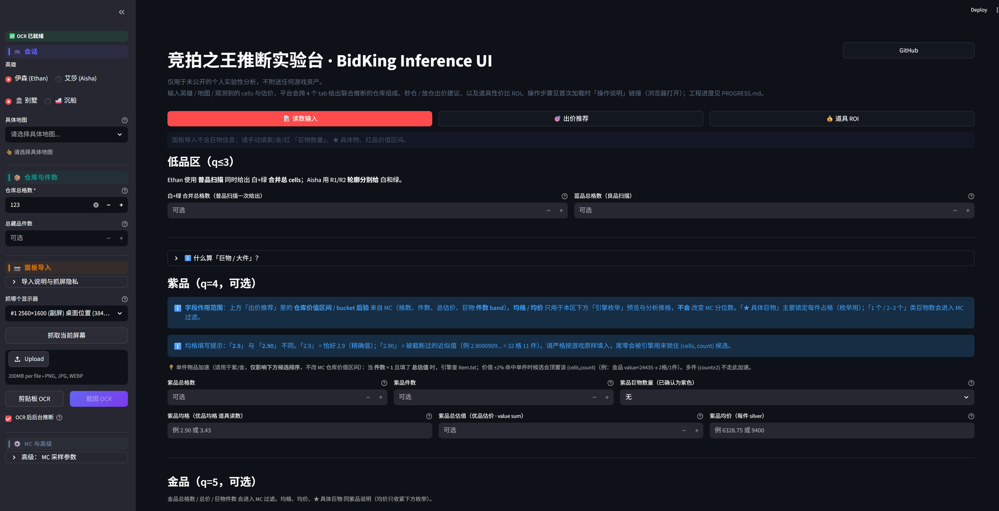
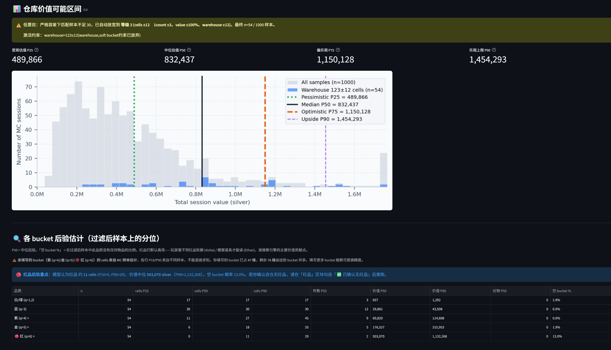

<p align="right">🌐 <strong>English</strong> · <a href="./README.zh-CN.md">中文</a></p>

# bidking-lab

> **A probabilistic inference engine + Streamlit dashboard for the sealed-bid auction game *The Bid King* (竞拍之王) — quantifying the value of hero skills, scanner tools, and map hints, and turning them into actionable bid recommendations.**

[](./LICENSE)
[](https://www.python.org/)
[](https://streamlit.io/)
[](./tests)
[](./PROGRESS.md)

---

## Demo

https://github.com/user-attachments/assets/9fb463dc-ca85-4fc0-b10e-56b81091a5a8

> 30-second walkthrough: pick a map → fill readings (manual or OCR sidebar) → switch to the bidding tab for the value distribution, bucket posteriors, and analytical estimate.

### Snapshots

<table>
<tr>
<td width="50%" align="center"><strong>1. Readings tab + OCR sidebar + live candidate preview</strong><br/></td>
<td width="50%" align="center"><strong>2. Bidding tab — MC histogram + bucket posterior table</strong><br/></td>
</tr>
</table>

> **Left**: three main tabs (Readings / Bidding / Tool ROI). The readings tab shows per-field scope captions (MC vs enumeration vs analytical only), OCR capture in the sidebar, and bottom candidate previews that can show ⚠️ *no legal candidates* without blocking inference above.
> **Right**: conditional Monte Carlo (default **1,000** samples, slider 500–5,000), histogram with P25/P50/P75/P90, per-bucket posterior cards, and the analytical estimate band. Snipe / walk-away cards remain **experimental and hidden** (`_ENABLE_SNIPE_PASS_HINTS=False`).

---

## What it is · TL;DR

*The Bid King* is a single-player game whose core loop is a **sealed-bid auction under partial information**: the player spends silver on scanner tools to reveal partial information about an opaque warehouse (e.g. *"purple items total 35 cells"*, *"gold items average 9,400 silver each"*), then decides how much to bid for the warehouse.

**bidking-lab turns this decision into math.**

- **Data layer**: decodes the game's `Tables/*.txt` (base64 + TSV) into typed JSON — 1,132 collectibles, 64 tools, 105 maps, 20 heroes, all schema-validated
- **Inference layer**: takes the player's observations → joint posterior over each quality bucket's `(total_cells, count)` top-3 candidates; conditional Monte-Carlo for bid distribution P25/P50/P75/P90 + snipe / walk-away recommendations
- **Tool valuation**: leave-one-out ROI quantifying how much value a tool recovers per silver spent, given the chosen map and hero
- **Surface**: Chinese-localized Streamlit UI + 5 analysis notebooks + end-to-end CLI scripts

This is an unaffiliated hobby project. It **ships no game assets** — it decodes the player's locally-installed copy and outputs *derived* JSON.

---

## Why this project · the engineering problem

| Player pain point | Mathematical form | What bidking-lab gives back |
|---|---|---|
| *"Are scanner tools worth their silver? Which combo is best?"* | Tool value attribution under partial observation | LOO ROI engine + sensitivity to price / hero / player-eyeball-noise |
| *"I see purple `avg_cells = 2.90` — what does the trailing zero tell me?"* | Decimal-precision leakage from a truncated UI display | `display.py` floor-at-2dp inversion: distinguishes exact `2.9` from approximated `2.90` (count likely *not* divisible by 10) |
| *"How much should I bid? Snipe or walk away?"* | Conditional Monte-Carlo on observed warehouse cells | Snipe / walk-away dual gate with three-tier fallback (low-confidence flag when samples are scarce) |
| *"Do optimal kits change across maps and heroes?"* | Hero × Map × Tool-kit contrast experiments | 4 analysis notebooks + a Streamlit UI that mixes the three freely |

---

## Quick start

```powershell
cd bidking-lab
python -m venv .venv
.\.venv\Scripts\Activate.ps1
pip install -r requirements.txt
pip install -e .

# 1) Run the test suite (406 tests)
pytest -q

# 2) Launch the Streamlit dashboard
streamlit run app/streamlit_app.py

# 3) End-to-end CLI demo (three scenarios, numbers only)
python scripts/demo_scenarios.py

# 4) End-to-end notebook (with distribution plots)
jupyter notebook notebooks/05_end_to_end_case.ipynb
```

> Verified on Windows / PowerShell + Python 3.13. macOS / Linux should work too with path tweaks.

To re-derive game tables (only needed if you own the game and want to refresh):

```powershell
$env:BIDKING_GAME_ROOT = "C:\path\to\steamapps\common\BidKing"
.\scripts\copy_game_tables.ps1           # copy Tables/*.txt into data/raw/
python scripts\build_processed_data.py   # regenerate data/processed/*.json
```

---

## Architecture

```
┌─────────────────────────────────────────────────────────────────────┐
│ Layer 3 · Surface                                                   │
│   app/streamlit_app.py           — 4-tab UI (Chinese)               │
│   notebooks/01..05_*.ipynb       — exploration + end-to-end case    │
│   scripts/demo_*.py              — CLI end-to-end checks            │
└──────────────────────────────────┬──────────────────────────────────┘
                                   │
┌──────────────────────────────────▼──────────────────────────────────┐
│ Layer 2 · Compute                                                   │
│   inference/                                                        │
│     ├── display.py             — game's 2-dp truncated display rule │
│     ├── observation.py         — SessionObs / QualityBucketObs DSL  │
│     ├── joint.py               — DFS joint posterior + warehouse    │
│     │                            pruning                            │
│     ├── posterior.py           — adaptive per-bucket MC filter +    │
│     │                            posterior stats (2026-05-16)       │
│     ├── synth_readings.py      — 11 tool definitions → reading DSL  │
│     ├── snipe.py               — snipe / walk-away gate +           │
│     │                            three-tier fallback                │
│     ├── roi.py                 — LOO tool ROI + player-eyeball      │
│     │                            noise model                        │
│     └── ground_truth.py        — map sampler (weighted drop pool)   │
│   simulation/                                                       │
│     ├── basic_mc.py            — full-map MC                        │
│     ├── hero_value.py          — timing-aware hero skill value      │
│     ├── bidding.py             — bid economic model                 │
│     └── robust_value.py        — long-tail rare-red item downweight │
└──────────────────────────────────┬──────────────────────────────────┘
                                   │
┌──────────────────────────────────▼──────────────────────────────────┐
│ Layer 1 · Data                                                      │
│   extract/                                                          │
│     ├── bid_map_table.py       — 105 maps, 21-column schema         │
│     ├── drop_table.py          — drop pools (item_id × weight)      │
│     ├── item_table.py          — 1,132 collectibles                 │
│     └── battle_item.py         — 64 scanner tools                   │
│   data/raw/tables/*.txt         — player's local game files (gitignored) │
│   data/processed/*.json         — our generated schema-validated JSON │
└─────────────────────────────────────────────────────────────────────┘
```

---

## Engineering highlights

### 1. Turning "UI display precision" into an information source
When the game shows *"purple `avg_cells = 2.90`"*, **the trailing zero carries information** — it means the true value was truncated into `[2.90, 2.91)`, which implies the denominator (item count) is almost certainly not divisible by 10. `inference/display.py` inverts the game's floor-at-2dp rule so `parse_reading("2.90")` can distinguish the exact value from the truncated approximation. In one playtesting scenario this single constraint collapses the q=4 candidate set from ~20 to 1.

### 2. Leave-one-out tool ROI + player-eyeball noise model
The original ROI implementation modelled "no warehouse-cells tool" as a fixed `capacity = 159` fallback, which made a 55,000-silver tool show as ROI = 0. After introducing `player_warehouse_noise_std` to simulate the player's own visual estimate error:

| σ (cells) | warehouse-tool ROI | Interpretation |
|---|---|---|
| 0  | 0.000 | Player has perfect eyeball → tool truly worthless |
| 10 | **0.446** | Realistic player → tool recovers 24,500 silver / 55,000 silver |
| 15 | 0.924 | Beginner → tool nearly pays for itself |

The Streamlit ROI tab exposes σ as a slider so the player can dial it.

### 3. Per-bucket MC filter (2026-05-16 fix)
On 2026-05-16 a playtest exposed that the bidding-hint MC filter only conditioned on warehouse cell count — *every other observation the player typed was silently ignored*, resulting in 2× over-estimation of warehouse value in info-rich sessions. The new `inference/posterior.py` (260 LoC) applies adaptive multi-constraint filtering:

- All five observation types (`cells / count / value_sum / value_range / huge_band`) become MC filters
- Three-tier tolerance widening (±2 → ±4 → ±8 cells) when sample count drops below 30, with `low_confidence` flag
- `total_cells = 0` / `count = 0` are treated as **exact assertions** — never widened, so *"I confirm no red items"* is a hard constraint
- New "per-bucket posterior" panel: posterior P10/P50/P90 for cells / count / value of each quality, plus probability that the bucket is empty

Real-data measurement on map T2 2405 (warehouse 72 cells):
- Before: median 369K silver (off by 2.5× from the actual ~150K)
- After: median 146K silver, n=16 / 2500 (low-confidence), P(red empty) = 100%

### 4. Schema-first data layer
Every game table is decoded into TSV → pydantic schema → typed JSON. Naming aligned with the raw data source: a 2026-05-15 audit caught a quality-tier mis-mapping (game's *优品=purple, 极品=gold, 珍品=red* vs my early code's *精品/珍品*) — system-wide rename and 202 tests still green.

### 5. 33-entry TROUBLESHOOTING.md with four-section bug postmortems
Every non-trivial gotcha (base64 tables / GBK encoding / `pyarrow` × `numpy 2.x` / `st.number_input` losing trailing zeros / matplotlib CJK font fallback / ROI baseline gap / `value=0` ambiguity vs explicit-zero / analytical estimator bypassing the brute-force enumerator / cascade bugs from `_build_session` not consuming `count`-only buckets / …) is documented as **symptom / root cause / fix / lesson**. See [**#33 — MC vs enumeration impact matrix**](TROUBLESHOOTING.md#33-各字段对-mc--枚举的影响矩阵设计预期) when a field change moves the bid histogram or candidate list.

### 6. Concretely-identified huge items as first-class observations
`BIG_ITEMS_BY_SHAPE` (~20 unique-shape huge items spanning purple / gold / red qualities) feeds the per-quality "huge band" selector directly: instead of just `1 / 2-3 / 4+`, the player can pick `★ 单人郊游快艇 (18格·106,500)` to exactly lock the cell count. The selector resolves into `huge_cells_override`, which propagates through enumeration and analytical estimate (`min_huge_cells()` → `candidates_for_bucket` → `_build_session` residual → `compute_analytical_estimate`). MC filtering still uses **huge count bands only** — by design (see TROUBLESHOOTING #31).

### 7. Inference field layering + low-risk backlog closed (2026-05-17)
- **MC path**: `cells / count / value_sum / value_range / huge_band` (count of huge items per bucket).
- **Enumeration path**: adds `avg_cells`, `avg_value`, `huge_cells_override`, Item-DB boost, physical max-cells cap.
- **Joint constraints**: when ≥4 reading fields are active, `avg_value` tolerance widens slightly for enumeration only (C-31b).
- **P0-B (C-32)**: `adaptive_filter` warehouse fallback now preserves `huge_cells_override` in `_fallback_hard_buckets` — consistency fix on the rare fallback path; see OBS #32.
- **Deferred**: snipe / walk-away UI (P0-A), avg_value in MC, per-item huge cells in MC (P2/P3).

### 8. Which inputs move MC vs enumeration? ([TROUBLESHOOTING #33](TROUBLESHOOTING.md#33-各字段对-mc--枚举的影响矩阵设计预期))

| Input / change | MC warehouse P25–P90 | Candidate preview / analytical estimate |
|---|---|---|
| Purple/gold/red `cells`, `value_sum`, huge **count band** | ✅ Yes | ✅ Yes |
| Red `total_cells = 0` / “confirmed no red” | ✅ **Hard** filter — P50 drops sharply (expected) | ✅ Yes |
| Red `huge_band` | ✅ Yes (count only) | ✅ Yes |
| `avg_cells`, `avg_value` | ❌ No | ✅ Yes only |
| `★` concrete huge item (`huge_cells_override`) | ❌ No (count band only) | ✅ Yes — exact cells (e.g. yacht = 18) |
| Generic huge “1” **without** `★` | Count only in MC | Floor = min footprint (purple **10**, gold/red **12**); pick `★` for yacht |
| Item-DB boost (`value_sum` + count=1 hits one item) | ❌ No | ✅ Re-ranks candidates only |
| C-32 fallback preserves override | Rare fallback path only | Full session unchanged |

**Huge defaults (by design):** cell floor = minimum standard huge per quality; value side uses `PER_CELL_VALUE_HUGE` (~7k/cell gold, ~30k/cell red) — not the cell mean. Full table + rationale: [TROUBLESHOOTING #33](TROUBLESHOOTING.md#33-各字段对-mc--枚举的影响矩阵设计预期).

---

## Findings · numbers

Full details in [`PROGRESS.md`](PROGRESS.md) and [`OBSERVATIONS.md`](OBSERVATIONS.md):

| Dimension | Number |
|---|---|
| Game tables parsed | 6 (BidMap / Drop / Item / BattleItem / Hero / Item_Type) |
| Schema-typed entities | 1,132 items · 64 tools · 105 maps · 20 heroes |
| Unit tests | **234**, all green |
| Streamlit UI tabs | 4 (input / bidding hint / tool ROI / joint inference *experimental*) |
| Notebooks | 5 (map value · hero ranking · inference demo · ROI snipe · end-to-end case) |
| Phase 1A inference | **stable** — low-risk backlog closed; snipe/pass UI off |
| Commit history | C-1 ~ C-34, every entry with expanded design notes in PROGRESS |

---

## Layout

| Path | Purpose |
|---|---|
| `src/bidking_lab/extract/` | Decoders + schemas for 6 game tables |
| `src/bidking_lab/inference/` | Inference engine: display / observation / joint / posterior / snipe / roi |
| `src/bidking_lab/simulation/` | MC models: basic_mc / hero_value / bidding / robust_value |
| `app/streamlit_app.py` | Streamlit Chinese-localized main UI |
| `notebooks/` | 5 analysis + end-to-end case notebook |
| `scripts/` | Data generation / end-to-end demo / one-off probes |
| `tests/` | 234 unit tests |
| `data/raw/` | Player's local game files (gitignored) |
| `data/processed/` | Generated schema-validated JSON (committed — works without the game installed) |
| `docs/project_vision.md` | Original three-layer architecture vision |
| **`PROGRESS.md`** | **Project handoff doc**: status, hero analysis, roadmap |
| **`OBSERVATIONS.md`** | **Technical findings log**: per-checkpoint discoveries |
| **`TROUBLESHOOTING.md`** | **33 entries** — postmortems + [#33 MC vs enum matrix](TROUBLESHOOTING.md#33-各字段对-mc--枚举的影响矩阵设计预期) |

### What we ship vs. what we don't

`data/processed/*.json` is **derived data** (column names chosen by us, fields filtered, schema-validated) — not a byte copy of game files. This means people without the game installed can still run the simulator. `data/raw/tables/*.txt` is byte-identical to game files and **not** in git.

| File (in repo) | What | Size |
|---|---|---|
| `data/processed/items.json` | 1,132 items: id, name, quality (0–6), value, shape, tags | ~520 KB |
| `data/processed/items_droppable.json` | 883 items actually referenced by some drop pool | ~425 KB |
| `data/processed/battle_items.json` | 64 battle items with quality_color + effect | ~18 KB |
| `data/processed/heroes.json` | 20 heroes with skill descriptions | ~4 KB |
| `data/processed/maps.json` | 105 maps (summary form) | ~25 KB |

---

## Tech stack

- **Python 3.13** · `pydantic` (schema) · `numpy` / `scipy` (MC + posterior) · `matplotlib` (distribution plots)
- **Streamlit** (UI) · Jupyter (analysis deliverables)
- **pytest** (234 unit tests covering decode / inference / ROI / snipe / hero_value)
- **PowerShell** (data sync scripts; bash-equivalent path left as an interface)

---

## Attribution & license

Unaffiliated hobby project, **not** authorized by or affiliated with the game or Steam. Game assets remain the property of their owners — **no ripped binaries are distributed**.

Repository **source code** is MIT-licensed (see [`LICENSE`](LICENSE)). The license grants no rights to game assets, trademarks, or the player's locally-copied game data under `data/raw/`.

Inspiration & prior art:
- [Jrinky908/bidking](https://github.com/Jrinky908/bidking) — Monte-Carlo summaries, OCR notebook
- [nql1314/bidking-booooot](https://github.com/nql1314/bidking-booooot) (Apache-2.0) — architecture / log parsing / grid-view reference; details in [`docs/upstream_references.md`](docs/upstream_references.md)

---

## Roadmap

Full roadmap in [`PROGRESS.md`](PROGRESS.md). Short version:

**Done** (C-1 ~ C-37)

**Next** (C-38): startup wait UI while OCR warms; optional mini-game deferred.
- ✅ 6 game tables decoded + schema
- ✅ Inference engine v2 (joint posterior + warehouse pruning + truncated-display rule + huge-item band)
- ✅ Streamlit Chinese UI (3 main tabs + map static info panel); MC default **1000** samples
- ✅ Per-bucket adaptive MC filter (2026-05-16) — kills 2× over-estimation bug
- ✅ Analytical-estimate hardening (C-28) + ★ concrete huge items (C-29) + purple `avg_value` input (C-29)
- ✅ Pass/snipe red constraints in backend (C-30); **UI hidden** until P0-A resumes (C-31)
- ✅ Field-scope UI copy + joint-constraint enumeration relax (C-31b)
- ✅ P0-B: fallback preserves `huge_cells_override` (C-32)
- ✅ LOO tool ROI + player-eyeball noise model
- ✅ Screen capture + OCR prefill (C-35~39) · 7 notebooks · **406** unit tests · **47** TROUBLESHOOTING entries
- ✅ Bilingual README + demo video + screenshots

**Deferred / optional**
- ⏸ Snipe / walk-away UI + tier tuning (P0-A — user paused)
- ⏸ `avg_value` / ★ huge cells in MC (P2 — design split, see #31)
- ⏳ Progressive UI · BidMap 23-column patch

**Explicitly out of scope**
- Per-item observation API · inspection-tool ROI modelling

---

<sub>Made with too much coffee · 2026-05-17</sub>
