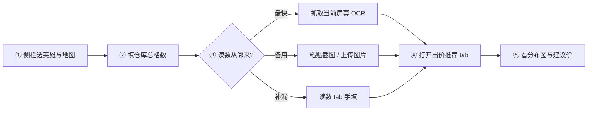
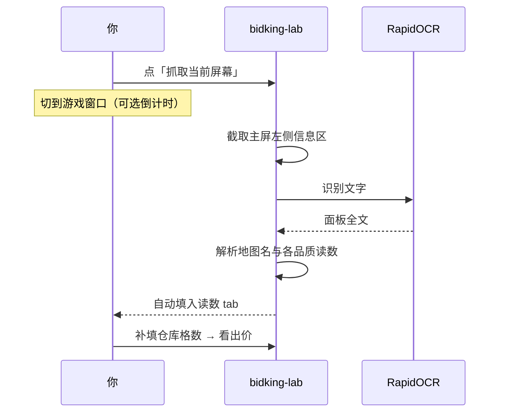
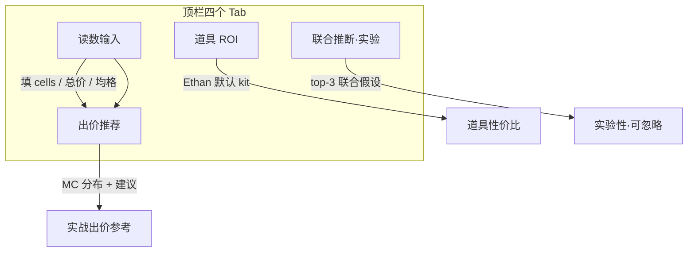

# bidking-lab · 操作说明（用户手册）

> **读者**：正在使用 Streamlit 推断台的玩家。  
> **不是**开发路线图 — 工程进度见 [`PROGRESS.md`](../PROGRESS.md)；踩坑见 [`TROUBLESHOOTING.md`](../TROUBLESHOOTING.md)。

---

## 这个工具做什么？

把游戏里**信息面板**上的文字（紫品总格、金品均价、地图名等）变成**可计算的约束**，再给出：

- 各品质 bucket 的候选 `(总格, 件数)`
- **出价推荐**（MC 分布 P25–P90）
- 道具 ROI（实验 tab）

**不会**自动替你出价，也**不**读取或修改游戏内存。

---

## 一屏上手（推荐顺序）

| 步骤 | 在哪做 | 要点 |
|------|--------|------|
| ① | 侧栏「会话」 | 先选**地图类型**再选**具体地图**；换图会按规则清空部分读数 |
| ② | 侧栏「仓库」 | OCR **通常不会**填这一项，请对照游戏内仓库容量**手填** |
| ③ | 侧栏「抓屏」或读数 tab | 游戏窗口在前台；信息区在屏幕**左侧中部** |
| ④ | 顶栏 **出价推荐** | 需已选地图 + 仓库格数 + 至少一条有效读数 |
| ⑤ | 同页 | 默认 MC **1500** 次；可勾选后台推断 |

---

## 抓屏 OCR 流程

**首次**打开应用时 OCR 模型需要 **暖机**（约 20–50 秒，视电脑而定）。暖机完成后，同一会话内再次抓屏会快很多。

---

## 四个主 Tab 分工

| Tab | 用途 |
|-----|------|
| **读数输入** | 紫/金/红/蓝/白各品质的格数、件数、总价、均格、巨物档 |
| **出价推荐** | 条件价值直方图、P25/P50/P75/P90、分析估算 |
| **道具 ROI** | _leave-one-out_ 道具价值（与当前地图/英雄相关） |
| **联合推断** | 实验功能，日常可不看 |

---

## 读数字段怎么理解？（简表）

| 游戏里常见说法 | 填哪里 | 进 MC 吗？ |
|----------------|--------|------------|
| 紫品总格 / 占位 | 紫品 **cells** | ✅ |
| 紫品件数 | **count** | ✅ |
| 紫品总价 / 总价值 | **value_sum** | ✅ |
| 紫品均格 2.90 | **均格**（文本框） | ❌ 主要帮**枚举候选** |
| 紫品均价 | **均价** | ❌ 同上 |
| 巨物「1 个」/ 具体船名 | **巨物 band** / ★ 下拉 | MC 看**件数**；★ 看**格数**（枚举） |

> 设计原则：**MC 用硬约束**；**均格/均价**用来收窄「一共有几种分法」——见 README 影响矩阵。

---

## 常见问题（30 秒）

1. **OCR 识别了地图，读数没填上？** — 换一张更清晰的截图，或手填；展开侧栏「上次导入」看 OCR 原文。
2. **紫品均格有数但框是空的？** — 已修复；若仍遇到请重启 Streamlit。
3. **切 tab 读数没了？** — 应在「读数输入」tab 填写；不要在别的 tab 长时间停留后指望未保存的侧栏字段。
4. **启动很慢？** — 首次 OCR 暖机；可在「高级 → MC 采样参数」关闭**实屏暖机**后重启（首次抓屏可能多几秒）。

---

## 相关文档

| 文档 | 内容 |
|------|------|
| [`README.zh-CN.md`](../README.zh-CN.md) | 安装、架构、方法论摘要 |
| [`PROGRESS.md`](../PROGRESS.md) | 版本与开发里程碑（给协作者） |
| [`TROUBLESHOOTING.md`](../TROUBLESHOOTING.md) | 安装与环境踩坑 #1–40 |

---

*最后更新：C-38（2026-05）· 与 Streamlit「操作说明」子页面同步。*
