# BidKing Lab v3 推理引擎设计草案

日期：2026-06-04  
状态：v3 kickoff 设计稿，尚未切换正式出价

## 0. 当前决策

v2 不再作为主要调参对象。后续 v2 只做三类低风险维护：

- live/archive/UI 防误导和数据采集修复。
- hard evidence 解析遗漏修复，例如公开 exact 总格/总件数。
- 作为 v3 shadow 的基线对照，不删除、不直接破坏现有脚本。

v3 的目标不是继续堆叠 q6 gate、floor、ratio，而是重建推理路径：

1. 所有有意义输入先进入统一证据注册表，不能靠临时字段被动发现。
2. hard constraints 先编译和求可行解，再采样，不靠 rejection 碰运气。
3. q6 presence、count、cells、ordinary value、tail scenario 分开建模。
4. 软证据必须是 likelihood 或明确的 diagnostic，不再混入不可解释的乘法补丁。
5. formal decision truth、raw settlement truth、tail replacement audit 三套口径分离。
6. v3 先以 shadow/evaluator/live reference 运行，通过验收后再讨论正式出价切换。

## 1. v2 已确认问题

### 1.1 输入覆盖不是系统性保证

2026-06-04 实机发现公开总格数已经在首屏给出，但 v2 parser 未读取 protobuf field `14`，UI 和模型仍显示估计值。这类问题不能靠继续调 q6 参数解决。v3 必须把“观察到的 public info id / action result / state field 是否建模”变成测试项。

v2 目前已补：

- `200009-200012`：公开 exact cells，hard。
- `200017-200020`：公开 exact count，hard。
- `200001-200003`：q4/q5/q6 outline exact bucket，hard。

v3 必须把这个规则泛化为 evidence registry，而不是继续在 parser 周边补 if/else。

### 1.2 q6 残差 sampler 过度耦合

v2 的 q6 问题表现为：

- q6 真实存在时，经常 `q6_gate_inactive`、`q6_below_drop_prior`、`q6_count/cells_under`、`q6_tail_value`。
- 无 q6 或无可规划 q6 时，统一抬高 P90 又会引入 extreme-over。
- Aisha deep floor、Ethan shipwreck conditional、Villa random_avg/layout 等补丁能局部改善，但会产生 profile 依赖和解释复杂度。

根因是 q6 presence、q6 count、q6 cells、q6 value、tail scenario 被混在一个残差生成流程里。v3 要把它们拆成可单独检查、可单独被证据影响的 latent variables。

### 1.3 rejection sampler 无法承受 hard exact 组合

公开 exact cells 接入后，v2 暴露出 cells-only exact 场景会 zero-match。已补 exact-cells residual fill，但剩余 zero-match 仍集中在多桶 exact cells/value/shape 组合。v3 不能把 hard constraints 当成采样后的过滤条件，必须先求可行结构，再在可行空间内采样。

### 1.4 软证据语义不统一

v2 中 `random_avg+layout`、公开均值、宝光 quality-only、max quality/cells、item reveal 等证据的语义分散在多个路径里。部分是 hard，部分是 soft，部分只是 diagnostic。v3 需要每个 evidence type 明确：

- 影响哪些 latent variables。
- 是 hard constraint、soft likelihood、prior feature，还是 diagnostic only。
- 是否影响 formal decision。
- 如何在 evaluator 中复跑和解释。

### 1.5 五个评估窗口和数据质量混在一起

真实 archive 验证支持当前窗口边界：每个窗口应截在本轮 `SEND 0x0022` 报价前，并包含该报价前已经收到的道具结果。但 archive 中存在两类质量问题：

- 有些 complete 局只留下 3-4 次报价。
- 部分 R1 第一条记录就是 bid，前面没有 state 或 public info。

v3 evaluator 必须把模型误差、采集缺口、结算 parser 差异分开报告，不能把 no-state 当成估值失败，也不能把结算解析冲突当成公开 exact 错误。

### 1.6 live 跨局和 UI 状态不能和估值混为一谈

当前已确认：

- 有 `0x0021` 或可识别 `0x0026/0x0027/0x0022/0x0025` 时可以切换新局。
- 有些局缺首个 state，只有 action/bid，模型不能安全给正式估值。
- capture session 领先 snapshot 时，UI 应隐藏旧局建议并显示等待状态。

v3 保持这个边界：缺 state 时不伪造正式估值；如果后续从 `0x0026` 或 status 中恢复足够信息，应作为新的 evidence source 单独建模和验收。

## 2. v3 成功标准

### 2.1 输入完整性

- 每个 archive/live 中出现的 public info id 必须被登记为 `hard`、`soft`、`diagnostic` 或 `ignored_with_reason`。
- `pending` 或 unknown id 在 v3 evaluator 中必须显式失败或至少标红，不允许静默遗漏。
- UI 展示的 exact/estimate 来源必须可追踪到 evidence id。
- 宝光/quality-only 继续保持边界：无轮廓点只作软线索，不生成 hard footprint；同 runtime 移动只记录最新 local_index，品质下界只算一次；已有 shape/footprint 时只补品质，不移动轮廓。

### 2.2 估值实战价值

v3 验收不只看一个 MAE：

- `formal_p50_abs_error`：对正式裁尾 truth，衡量正常估值。
- `formal_p50_signed_error` 和 under-rate：防止长期系统性低估。
- `formal_p90_coverage`：风险上沿是否覆盖可规划真值。
- `p90_extreme_over`：防止 P90 过度抬高影响实战判断。
- `q6_plannable_miss`：q6 可规划收益存在时 P90 是否仍低于 q6 truth。
- `q6_false_positive_or_control_over`：无 q6 或无可规划 q6 时是否误抬。
- `pinball_0.5` / `pinball_0.9`：统一衡量分位数预测质量。
- `raw_truth_abs_error`：保留原始结算对照，不作为 formal MAE 主口径。
- `tail_replacement_error`：审计被裁 tail 的普通替代价值，不进入正式出价。

### 2.3 分轮窗口

五个窗口固定为 R1-R5 的 pre-bid snapshot：

- R1：信息最少，要求不能给出误导性极窄区间。
- R2/R3：道具和公开信息开始进入，要求 evidence update 后 posterior 方向合理。
- R4：通常应明显收敛，重点检查 q6 miss 和 exact constraints。
- R5：最接近结算，要求 P50/P90 都稳定，数据缺口要单独标记。

所有指标必须按 window、hero、map/profile、q6/no-q6、data_quality tag 切分，同时保留整体视图。

## 3. v3 总体架构

```mermaid
flowchart LR
    A["raw packets / archived samples"] --> B["adapters"]
    B --> C["canonical evidence events"]
    C --> D["evidence registry coverage check"]
    D --> E["pre-bid timeline snapshots R1-R5"]
    E --> F["hard constraint compiler"]
    F --> G["feasible latent summary space"]
    G --> H["proposal engine"]
    H --> I["likelihood scoring"]
    I --> J["resample and repair"]
    J --> K["posterior report"]
    K --> L["evaluator / live shadow / UI contract"]
```



### 3.1 模块路径

建议新增独立包，先不移动 v2：

- `src/bidking_lab/inference/v3/__init__.py`
- `src/bidking_lab/inference/v3/evidence_registry.py`
- `src/bidking_lab/inference/v3/events.py`
- `src/bidking_lab/inference/v3/timeline.py`
- `src/bidking_lab/inference/v3/constraints.py`
- `src/bidking_lab/inference/v3/state.py`
- `src/bidking_lab/inference/v3/priors.py`
- `src/bidking_lab/inference/v3/likelihoods.py`
- `src/bidking_lab/inference/v3/proposals.py`
- `src/bidking_lab/inference/v3/smc.py`
- `src/bidking_lab/inference/v3/report.py`
- `src/bidking_lab/inference/v3/adapter_v2.py`

新增脚本：

- `scripts/evaluate_fatbeans_v3_samples.py`
- `scripts/compare_v2_v3_samples.py`
- `scripts/summarize_live_v3_shadow.py`

现有 live brief 可追加 `--engine v2|v3|both`，但第一阶段建议 v3 独立脚本，避免改坏现有 v2 brief。

### 3.2 外部参考采用方式

v3 不直接引入 Pyro/PyMC/pgmpy 作为运行依赖。原因：

- 当前问题包含大量游戏协议、hard exact、形状和局内窗口语义，项目原生数据结构更易调试。
- Pyro/PyMC 的价值在于概率建模范式和 SMC/importance sampling 思路，不在于强行把所有字段塞进第三方模型。
- pgmpy 的价值在于因子图/贝叶斯网络的组合 API 思想，但本项目需要自定义约束求解和 item/table 采样。

借鉴点：

- 概率模型要显式声明随机变量和观测条件。
- 顺序局内证据适合用 filtering/SMC 方式逐步更新，而不是每轮重跑无条件残差。
- soft evidence 应进入 likelihood 或 proposal guide，不能只作为后处理乘子。
- hard constraints 应先约束可行空间，再进行 weighted sampling。

## 4. 核心数据模型

### 4.1 EvidenceEvent

建议字段：

```python
@dataclass(frozen=True)
class EvidenceEvent:
    event_id: str
    source: str
    session_id: str | None
    sort_id: int | None
    round_index: int | None
    hero_id: int | None
    map_id: int | None
    public_info_id: int | None
    action_id: int | None
    semantic: str
    strength: Literal["hard", "soft", "diagnostic", "ignored"]
    payload: Mapping[str, object]
    raw_path: str | None
```

所有 parser 输出先变成 `EvidenceEvent`，再由 registry 映射到 constraints/likelihoods。

### 4.2 EvidenceSpec

```python
@dataclass(frozen=True)
class EvidenceSpec:
    semantic: str
    source_ids: tuple[str, ...]
    strength: Literal["hard", "soft", "diagnostic", "ignored"]
    targets: tuple[str, ...]
    parser_contract: str
    handler: str
    affects_formal: bool
    tests: tuple[str, ...]
    notes: str
```

registry 覆盖检查要求：archive 中出现的 source id 必须能找到 EvidenceSpec。

### 4.3 LatentState

v3 latent summary 先不生成完整 item grid，而是先建结构摘要：

```python
@dataclass
class QualityBucketState:
    quality: int
    count: int
    cells: int
    ordinary_value: float
    tail_value_raw: float
    tail_value_formal: float
    tail_replacement_value: float

@dataclass
class SessionLatentState:
    hero_id: int
    map_id: int
    total_count: int
    total_cells: int
    buckets: dict[int, QualityBucketState]
    q6_presence: bool
    q6_tail_scenario: str
    shape_anchors: tuple[object, ...]
    item_anchors: tuple[object, ...]
```

完整 item/grid allocation 是第二层，用于满足 shape、local_index、full imaging、item reveal 和 UI detail。

## 5. Evidence registry 初始范围

| 输入类别 | v3 语义 | 强度 | 目标 latent | formal 影响 |
| --- | --- | --- | --- | --- |
| `200009-200012` exact cells | exact total / q4 / q5 / q6 cells | hard | total_cells, bucket.cells | 是 |
| `200017-200020` exact count | exact total / q4 / q5 / q6 count | hard | total_count, bucket.count | 是 |
| `200001-200003` outline | q4/q5/q6 exact outline bucket | hard | bucket.count/cells/shape anchors | 是 |
| full imaging / item reveal | exact item/value/shape/local | hard | item anchors, bucket totals | 是 |
| max quality / max cells | upper or lower bound | hard 或 soft，按协议确认 | bucket presence, item cells | 是 |
| avg cells / avg value | sample mean likelihood | soft | count/cells/value distribution | 是 |
| random_avg + layout | conditional likelihood, not fixed q6 multiplier | soft | q6 presence/count/cells/value | 先 shadow，验收后再议 |
| 宝光 quality-only | local quality clue | soft | quality lower bound, q6 presence | 是，但不生成 footprint |
| minimap layout estimate | occupancy likelihood | soft | total_cells, shape distribution | 是 |
| player bids | market behavior signal | diagnostic 或单独 bid model | 不直接改 inventory truth |
| tail replacement | audit replacement value | diagnostic | tail_replacement_value | 否 |

registry 需要同时记录 ignored 输入，例如心跳、空 ack、无可用字段的 `0x0027`。

## 6. 推理流程

### 6.1 hard constraint compiler

输入：某个 pre-bid window 的全部 hard EvidenceEvent。  
输出：

- `ConstraintSet`：总件数、总格数、按品质 count/cells/value、item anchors、shape anchors、local bounds。
- `FeasibilityReport`：是否可行；冲突来源；若结算 truth 与 public exact 冲突，标 data_quality，不静默降级。

约束编译原则：

- exact 数值永远不作为 soft likelihood 处理。
- exact 互相冲突时，v3 报 infeasible，并列出 evidence id。
- 不用放宽 hard exact 来制造 match；放宽只能是 evaluator 的 diagnostic mode。
- total exact cells but no total count 是合法场景，必须有条件构造可行 count/cells 组合。

### 6.2 feasible summary generator

先在 quality bucket 层求可行摘要空间：

- 根据 hero/map/drop table 产生先验候选。
- 用 dynamic programming 或枚举剪枝满足 total_count、total_cells、bucket exact。
- 对 q6 单独产生 presence/count/cells 候选，而不是从剩余格随机落点。
- 输出一批可行 `SessionLatentState` 摘要。

这里的目标不是生成很多 trials，而是保证候选空间覆盖合理的 q6 结构。

### 6.3 proposal engine

proposal 需要被证据条件化：

- public exact 缩小 count/cells 空间。
- avg cells/value 改变候选权重或 proposal 分布。
- random_avg+layout 影响 q6 count/cells/value 的条件概率，而不是固定乘 prior expected cells。
- quality-only q6 点提高 q6 presence/count 的概率，但不创建 hard footprint。
- shape anchors 只在有轮廓时约束 shape/local。

如果 effective sample size 低，v3 不优先增加 trials，而是报告是哪类 evidence/proposal 导致退化。

### 6.4 likelihood scoring

每个 soft evidence 单独贡献 log likelihood：

- `AvgCellsLikelihood`
- `AvgValueLikelihood`
- `RandomAvgLikelihood`
- `LayoutLikelihood`
- `QualityOnlyLikelihood`
- `MaxItemLikelihood`
- `BidBehaviorLikelihood`，仅在单独 bid model 中启用

posterior report 必须能输出 top positive/negative evidence contributors，方便解释“为什么这轮低估/高估”。

### 6.5 tail/value 处理

v3 继续分三套价值：

- `raw_value`：结算真实值，包含极端 tail。
- `formal_value`：正式裁尾、可规划口径，作为出价主线。
- `tail_replacement_value`：把被裁掉 tail 替换为同品质同形状普通红的审计值。

P50 MAE 默认对 formal truth；P90 coverage 默认也对 formal truth。raw 和 replacement 只作为对照列。这样允许 P90 体现长尾风险，但不让 raw tail 把正常 MAE 带偏。

## 7. evaluator 与验收

### 7.1 必备报表

每次 v3 对照至少输出：

- overall：样本数、ok、zero_match、infeasible、data_quality。
- by window：R1-R5 的 P50/P90/pinball/q6 miss。
- by hero/map/profile：Aisha/Ethan、Villa/Shipwreck/Hidden 等。
- q6 split：q6 plannable、q6 raw only、no-q6/control。
- evidence coverage：unknown/pending public id、unmodeled action、ignored counts。
- paired compare：v3 vs v2 formal，helped/worsened/no-change。
- severe case table：top P90 misses、top extreme-over、top under P50。

### 7.2 初始 promotion gate

v3 进入 live shadow 前：

- public info coverage：unknown/pending 必须为 0，ignored 必须有理由。
- 五窗口生成：no-state 与模型失败分开统计。
- hard exact feasibility：已知 exact-only、exact-cells-only、多 bucket exact 样本可复跑。
- 单测覆盖 quality-only 边界和 tail replacement 不进 formal。

v3 可进入正式候选前：

- 全 archive paired compare 不低于 v2 的 formal P50 主要指标。
- q6 plannable miss 明显下降，尤其是 Ethan Villa、Aisha 2506 R2/R3/R4、Ethan public random_avg+layout。
- no-q6/control extreme-over 不超过 v2 基线的可接受浮动。
- 最近 live shadow 连续样本中不再出现大量“道具后突然坍缩到极低”的估值。
- UI contract 中 v2/v3 字段命名稳定，`affects_bid` 明确。

## 8. 测试计划

### 8.1 registry 测试

- 扫描 `data/samples/fatbeans`，枚举所有 public info id，断言都在 registry。
- 对每个 hard public id 建 parser fixture，验证 protobuf field path。
- 对 ignored id 断言 ignored reason 存在。

### 8.2 窗口测试

- 确认 R1-R5 snapshot 截止在对应 `SEND 0x0022` 前。
- 确认报价前已收到的 `0x0027` direct action 被纳入窗口。
- 确认 no-state R1 被标为 capture gap，不进入模型精度分母。

### 8.3 约束测试

- exact total cells without total count。
- exact q6 cells/count 与 total exact 同时存在。
- item reveal + shape anchor + public exact 组合。
- hard conflict 报告 evidence id，不静默 fallback。

### 8.4 推理测试

- q6/no-q6 paired fixtures。
- Aisha 2506 R2/R3/R4 tail/value fixtures。
- Ethan Villa public random_avg+layout fixtures。
- quality-only q6 local fixtures：不生成 footprint，能影响 q6 presence likelihood。
- tail replacement fixtures：formal 不变，audit 字段变化。

### 8.5 live/UI 测试

- capture session 领先 snapshot 时隐藏旧局建议。
- v3 shadow 字段缺失时 UI 不崩溃。
- exact 总格/总件数优先显示 exact source。
- `q6_risk_reference.affects_bid=false` 时不改变停止价。

## 9. 迁移计划

### Phase 0：设计与路径冻结

- 新增本文档。
- 在 `PROGRESS.md` / `DECISIONS.md` 记录 v3 kickoff。
- 不移动 v2，不改默认 live formal。

### Phase 1：Evidence registry 与 v2 adapter

- 建 `inference/v3/evidence_registry.py` 和 `events.py`。
- 从现有 `live/fatbeans.py`、`inference/observation.py`、archive reader 生成 `EvidenceEvent`。
- 先只做 coverage report，不做估值替换。

### Phase 2：hard constraint compiler

- 实现 exact count/cells/value/shape constraints。
- 用当前 355 archive 全量跑 feasibility。
- 修掉 infeasible 中属于 parser/adapter 的问题，剩余冲突标 data_quality。

### Phase 3：v3 posterior shadow

- 实现 feasible summary generator、proposal、likelihood scoring。
- 输出 `V3PosteriorReport`，包含 formal/raw/replacement。
- 跑 `compare_v2_v3_samples.py`，只做 offline paired compare。

### Phase 4：live shadow 接入

- live artifact 增加 `ui_contract.v3_shadow`。
- UI 展示 v3 诊断和风险参考，但默认 `affects_bid=false`。
- brief 增加 v2/v3 paired rows。

### Phase 5：正式候选与 v2 归档

- 达到 promotion gate 后，讨论是否让 v3 成为 formal decision。
- v2 不删除。归档分两步：
  1. 逻辑归档：冻结 v2 参数、文档、基线指标，默认入口切 v3。
  2. 物理归档：只有在所有 imports/scripts/tests 改完并通过后，才把 v2 代码移入 `src/bidking_lab/inference/archive_v2/` 或保留 thin compatibility wrapper。

这个顺序是为了避免路径整理导致脚本不可运行。

## 10. 项目目录整理原则

后续整理目录时建议：

- 项目源码只放 `src/bidking_lab`。
- 外部参考放入 `references/` 或 `third_party/`，例如 `grid_view_v1.3.7`、`AuctionAnalyzer4.13.3`、zip 反编译产物。
- `bidking_lab.egg-info` 属于构建产物，应从源码逻辑中剥离，按 packaging 规则处理。
- 移动前用 `rg` 找路径引用，移动后跑 pytest 和关键脚本。
- 任何路径重组都先保持 compatibility alias 或配置项，避免 live 脚本、archive 脚本和 UI 同时断。

目录整理不应和 v3 core 重构混在同一个大 diff 中；先保证 v3 shadow 可跑，再做结构清理。

## 11. 当前优先任务

1. 建 v3 evidence registry 和 coverage checker。
2. 用 355 archive 跑 public/action/state coverage。
3. 实现 hard constraint compiler，先解决 exact 多约束可行性。
4. 复刻 v2 formal/raw/replacement truth 口径，避免指标再次混淆。
5. 对 Ethan Villa random_avg/q6 gate 与 Aisha 2506 tail/value sampler 建 fixture。
6. 再开始 q6 条件 likelihood / count-cell-value sampler。

### 2026-06-04 执行进展

- Phase 1/2 已有可跑实现：registry coverage、canonical `EvidenceEvent`、hard numeric/item/shape/quality-floor constraint compiler。
- Phase 3 已起步：archive pre-bid evaluator 能按报价前窗口输出 ConstraintSet、FeasibleSummaryReport、确定性 drop prior、settlement raw truth、formal decision truth、tail-replacement audit truth。
- 当前 prior/truth 字段仅为 shadow 诊断；posterior 仍是下一步。
- 默认准确率分母应使用 ready 窗口的 `v3_truth_formal_decision_value`；raw/replacement 只能作为明确命名的对照指标。
- 后续 sampler 必须以 `FeasibleSummaryReport` 为 hard 输入，再做条件 likelihood；不回到 v2 的“先采样再 reject 所有证据”的主路径。
- outline/full-outline 的 count/cells exact 必须由 compiler 从 observed_items 派生，不允许 sampler 直接复用 raw payload value。

## 12. 参考资料

- Pyro inference docs：说明 probabilistic inference、importance sampling、SMCFilter、ESS/resampling 等接口思想。https://docs.pyro.ai/en/stable/inference.html
- PyMC overview：说明概率编程把随机变量和观测条件显式建模，并支持可交互调试的 Python 建模方式。https://www.pymc.io/projects/docs/en/stable/learn/core_notebooks/pymc_overview.html
- pgmpy docs：说明概率图模型、因子图、exact/approximate inference 的可组合 API 思路。https://pgmpy.org/
- Doucet, Godsill, Andrieu, 2000, On Sequential Monte Carlo Sampling Methods for Bayesian Filtering：作为顺序证据 filtering / particle 方法的理论参考。https://www.stats.ox.ac.uk/~doucet/doucet_godsill_andrieu_sequentialmontecarloforbayesfiltering.pdf
