# BidKing Lab v3 推理引擎设计草案

日期：2026-06-04  
状态：v3 kickoff 设计稿，尚未切换正式出价

## 0. 当前决策

v2 不再作为主要调参对象。后续 v2 只做三类低风险维护：

- live/archive/UI 防误导和数据采集修复。
- hard evidence 解析遗漏修复，例如公开 exact 总格/总件数。
- 作为 v3 shadow 的基线对照，不删除、不直接破坏现有脚本。

v3 的目标不是继续堆叠 q6 gate、floor、ratio，而是重建推理路径：

1. 所有有意义输入先进入统一证据注册表，不能靠临时字段被动发现。
2. hard constraints 先编译和求可行解，再采样，不靠 rejection 碰运气。
3. q6 presence、count、cells、ordinary value、tail scenario 分开建模。
4. 软证据必须是 likelihood 或明确的 diagnostic，不再混入不可解释的乘法补丁。
5. formal decision truth、raw settlement truth、tail replacement audit 三套口径分离。
6. v3 先以 shadow/evaluator/live reference 运行，通过验收后再讨论正式出价切换。

## 1. v2 已确认问题

### 1.1 输入覆盖不是系统性保证

2026-06-04 实机发现公开总格数已经在首屏给出，但 v2 parser 未读取 protobuf field `14`，UI 和模型仍显示估计值。这类问题不能靠继续调 q6 参数解决。v3 必须把“观察到的 public info id / action result / state field 是否建模”变成测试项。

v2 目前已补：

- `200009-200012`：公开 exact cells，hard。
- `200017-200020`：公开 exact count，hard。
- `200001-200003`：q4/q5/q6 outline exact bucket，hard。

v3 必须把这个规则泛化为 evidence registry，而不是继续在 parser 周边补 if/else。

### 1.2 q6 残差 sampler 过度耦合

v2 的 q6 问题表现为：

- q6 真实存在时，经常 `q6_gate_inactive`、`q6_below_drop_prior`、`q6_count/cells_under`、`q6_tail_value`。
- 无 q6 或无可规划 q6 时，统一抬高 P90 又会引入 extreme-over。
- Aisha deep floor、Ethan shipwreck conditional、Villa random_avg/layout 等补丁能局部改善，但会产生 profile 依赖和解释复杂度。

根因是 q6 presence、q6 count、q6 cells、q6 value、tail scenario 被混在一个残差生成流程里。v3 要把它们拆成可单独检查、可单独被证据影响的 latent variables。

### 1.3 rejection sampler 无法承受 hard exact 组合

公开 exact cells 接入后，v2 暴露出 cells-only exact 场景会 zero-match。已补 exact-cells residual fill，但剩余 zero-match 仍集中在多桶 exact cells/value/shape 组合。v3 不能把 hard constraints 当成采样后的过滤条件，必须先求可行结构，再在可行空间内采样。

### 1.4 软证据语义不统一

v2 中 `random_avg+layout`、公开均值、宝光 quality-only、max quality/cells、item reveal 等证据的语义分散在多个路径里。部分是 hard，部分是 soft，部分只是 diagnostic。v3 需要每个 evidence type 明确：

- 影响哪些 latent variables。
- 是 hard constraint、soft likelihood、prior feature，还是 diagnostic only。
- 是否影响 formal decision。
- 如何在 evaluator 中复跑和解释。

### 1.5 五个评估窗口和数据质量混在一起

真实 archive 验证支持当前窗口边界：每个窗口应截在本轮 `SEND 0x0022` 报价前，并包含该报价前已经收到的道具结果。但 archive 中存在两类质量问题：

- 有些 complete 局只留下 3-4 次报价。
- 部分 R1 第一条记录就是 bid，前面没有 state 或 public info。

v3 evaluator 必须把模型误差、采集缺口、结算 parser 差异分开报告，不能把 no-state 当成估值失败，也不能把结算解析冲突当成公开 exact 错误。

### 1.6 live 跨局和 UI 状态不能和估值混为一谈

当前已确认：

- 有 `0x0021` 或可识别 `0x0026/0x0027/0x0022/0x0025` 时可以切换新局。
- 有些局缺首个 state，只有 action/bid，模型不能安全给正式估值。
- capture session 领先 snapshot 时，UI 应隐藏旧局建议并显示等待状态。

v3 保持这个边界：缺 state 时不伪造正式估值；如果后续从 `0x0026` 或 status 中恢复足够信息，应作为新的 evidence source 单独建模和验收。

## 2. v3 成功标准

### 2.1 输入完整性

- 每个 archive/live 中出现的 public info id 必须被登记为 `hard`、`soft`、`diagnostic` 或 `ignored_with_reason`。
- `pending` 或 unknown id 在 v3 evaluator 中必须显式失败或至少标红，不允许静默遗漏。
- UI 展示的 exact/estimate 来源必须可追踪到 evidence id。
- 宝光/quality-only 继续保持边界：无轮廓点只作软线索，不生成 hard footprint；同 runtime 移动只记录最新 local_index，品质下界只算一次；已有 shape/footprint 时只补品质，不移动轮廓。

### 2.2 估值实战价值

v3 验收不只看一个 MAE：

- `formal_p50_abs_error`：对正式裁尾 truth，衡量正常估值。
- `formal_p50_signed_error` 和 under-rate：防止长期系统性低估。
- `formal_p90_coverage`：风险上沿是否覆盖可规划真值。
- `p90_extreme_over`：防止 P90 过度抬高影响实战判断。
- `q6_plannable_miss`：q6 可规划收益存在时 P90 是否仍低于 q6 truth。
- `q6_false_positive_or_control_over`：无 q6 或无可规划 q6 时是否误抬。
- `pinball_0.5` / `pinball_0.9`：统一衡量分位数预测质量。
- `raw_truth_abs_error`：保留原始结算对照，不作为 formal MAE 主口径。
- `tail_replacement_error`：审计被裁 tail 的普通替代价值，不进入正式出价。

### 2.3 分轮窗口

五个窗口固定为 R1-R5 的 pre-bid snapshot：

- R1：信息最少，要求不能给出误导性极窄区间。
- R2/R3：道具和公开信息开始进入，要求 evidence update 后 posterior 方向合理。
- R4：通常应明显收敛，重点检查 q6 miss 和 exact constraints。
- R5：最接近结算，要求 P50/P90 都稳定，数据缺口要单独标记。

所有指标必须按 window、hero、map/profile、q6/no-q6、data_quality tag 切分，同时保留整体视图。

## 3. v3 总体架构

```mermaid
flowchart LR
    A["raw packets / archived samples"] --> B["adapters"]
    B --> C["canonical evidence events"]
    C --> D["evidence registry coverage check"]
    D --> E["pre-bid timeline snapshots R1-R5"]
    E --> F["hard constraint compiler"]
    F --> G["feasible latent summary space"]
    G --> H["proposal engine"]
    H --> I["likelihood scoring"]
    I --> J["resample and repair"]
    J --> K["posterior report"]
    K --> L["evaluator / live shadow / UI contract"]
```



### 3.1 模块路径

建议新增独立包，先不移动 v2：

- `src/bidking_lab/inference/v3/__init__.py`
- `src/bidking_lab/inference/v3/evidence_registry.py`
- `src/bidking_lab/inference/v3/events.py`
- `src/bidking_lab/inference/v3/timeline.py`
- `src/bidking_lab/inference/v3/constraints.py`
- `src/bidking_lab/inference/v3/state.py`
- `src/bidking_lab/inference/v3/priors.py`
- `src/bidking_lab/inference/v3/likelihoods.py`
- `src/bidking_lab/inference/v3/proposals.py`
- `src/bidking_lab/inference/v3/smc.py`
- `src/bidking_lab/inference/v3/report.py`
- `src/bidking_lab/inference/v3/adapter_v2.py`

新增脚本：

- `scripts/evaluate_fatbeans_v3_samples.py`
- `scripts/compare_v2_v3_samples.py`
- `scripts/summarize_live_v3_shadow.py`

现有 live brief 可追加 `--engine v2|v3|both`，但第一阶段建议 v3 独立脚本，避免改坏现有 v2 brief。

### 3.2 外部参考采用方式

v3 不直接引入 Pyro/PyMC/pgmpy 作为运行依赖。原因：

- 当前问题包含大量游戏协议、hard exact、形状和局内窗口语义，项目原生数据结构更易调试。
- Pyro/PyMC 的价值在于概率建模范式和 SMC/importance sampling 思路，不在于强行把所有字段塞进第三方模型。
- pgmpy 的价值在于因子图/贝叶斯网络的组合 API 思想，但本项目需要自定义约束求解和 item/table 采样。

借鉴点：

- 概率模型要显式声明随机变量和观测条件。
- 顺序局内证据适合用 filtering/SMC 方式逐步更新，而不是每轮重跑无条件残差。
- soft evidence 应进入 likelihood 或 proposal guide，不能只作为后处理乘子。
- hard constraints 应先约束可行空间，再进行 weighted sampling。

## 4. 核心数据模型

### 4.1 EvidenceEvent

建议字段：

```python
@dataclass(frozen=True)
class EvidenceEvent:
    event_id: str
    source: str
    session_id: str | None
    sort_id: int | None
    round_index: int | None
    hero_id: int | None
    map_id: int | None
    public_info_id: int | None
    action_id: int | None
    semantic: str
    strength: Literal["hard", "soft", "diagnostic", "ignored"]
    payload: Mapping[str, object]
    raw_path: str | None
```

所有 parser 输出先变成 `EvidenceEvent`，再由 registry 映射到 constraints/likelihoods。

### 4.2 EvidenceSpec

```python
@dataclass(frozen=True)
class EvidenceSpec:
    semantic: str
    source_ids: tuple[str, ...]
    strength: Literal["hard", "soft", "diagnostic", "ignored"]
    targets: tuple[str, ...]
    parser_contract: str
    handler: str
    affects_formal: bool
    tests: tuple[str, ...]
    notes: str
```

registry 覆盖检查要求：archive 中出现的 source id 必须能找到 EvidenceSpec。

### 4.3 LatentState

v3 latent summary 先不生成完整 item grid，而是先建结构摘要：

```python
@dataclass
class QualityBucketState:
    quality: int
    count: int
    cells: int
    ordinary_value: float
    tail_value_raw: float
    tail_value_formal: float
    tail_replacement_value: float

@dataclass
class SessionLatentState:
    hero_id: int
    map_id: int
    total_count: int
    total_cells: int
    buckets: dict[int, QualityBucketState]
    q6_presence: bool
    q6_tail_scenario: str
    shape_anchors: tuple[object, ...]
    item_anchors: tuple[object, ...]
```

完整 item/grid allocation 是第二层，用于满足 shape、local_index、full imaging、item reveal 和 UI detail。

## 5. Evidence registry 初始范围

| 输入类别 | v3 语义 | 强度 | 目标 latent | formal 影响 |
| --- | --- | --- | --- | --- |
| `200009-200012` exact cells | exact total / q4 / q5 / q6 cells | hard | total_cells, bucket.cells | 是 |
| `200017-200020` exact count | exact total / q4 / q5 / q6 count | hard | total_count, bucket.count | 是 |
| `200001-200003` outline | q4/q5/q6 exact outline bucket | hard | bucket.count/cells/shape anchors | 是 |
| full imaging / item reveal | exact item/value/shape/local | hard | item anchors, bucket totals | 是 |
| max quality / max cells | upper or lower bound | hard 或 soft，按协议确认 | bucket presence, item cells | 是 |
| avg cells / avg value | sample mean likelihood | soft | count/cells/value distribution | 是 |
| random_avg + layout | conditional likelihood, not fixed q6 multiplier | soft | q6 presence/count/cells/value | 先 shadow，验收后再议 |
| 宝光 quality-only | local quality clue | soft | quality lower bound, q6 presence | 是，但不生成 footprint |
| minimap layout estimate | occupancy likelihood | soft | total_cells, shape distribution | 是 |
| player bids | market behavior signal | diagnostic 或单独 bid model | 不直接改 inventory truth |
| tail replacement | audit replacement value | diagnostic | tail_replacement_value | 否 |

registry 需要同时记录 ignored 输入，例如心跳、空 ack、无可用字段的 `0x0027`。

## 6. 推理流程

### 6.1 hard constraint compiler

输入：某个 pre-bid window 的全部 hard EvidenceEvent。  
输出：

- `ConstraintSet`：总件数、总格数、按品质 count/cells/value、item anchors、shape anchors、local bounds。
- `FeasibilityReport`：是否可行；冲突来源；若结算 truth 与 public exact 冲突，标 data_quality，不静默降级。

约束编译原则：

- exact 数值永远不作为 soft likelihood 处理。
- exact 互相冲突时，v3 报 infeasible，并列出 evidence id。
- 不用放宽 hard exact 来制造 match；放宽只能是 evaluator 的 diagnostic mode。
- total exact cells but no total count 是合法场景，必须有条件构造可行 count/cells 组合。

### 6.2 feasible summary generator

先在 quality bucket 层求可行摘要空间：

- 根据 hero/map/drop table 产生先验候选。
- 用 dynamic programming 或枚举剪枝满足 total_count、total_cells、bucket exact。
- 对 q6 单独产生 presence/count/cells 候选，而不是从剩余格随机落点。
- 输出一批可行 `SessionLatentState` 摘要。

这里的目标不是生成很多 trials，而是保证候选空间覆盖合理的 q6 结构。

### 6.3 proposal engine

proposal 需要被证据条件化：

- public exact 缩小 count/cells 空间。
- avg cells/value 改变候选权重或 proposal 分布。
- random_avg+layout 影响 q6 count/cells/value 的条件概率，而不是固定乘 prior expected cells。
- quality-only q6 点提高 q6 presence/count 的概率，但不创建 hard footprint。
- shape anchors 只在有轮廓时约束 shape/local。

如果 effective sample size 低，v3 不优先增加 trials，而是报告是哪类 evidence/proposal 导致退化。

### 6.4 likelihood scoring

每个 soft evidence 单独贡献 log likelihood：

- `AvgCellsLikelihood`
- `AvgValueLikelihood`
- `RandomAvgLikelihood`
- `LayoutLikelihood`
- `QualityOnlyLikelihood`
- `MaxItemLikelihood`
- `BidBehaviorLikelihood`，仅在单独 bid model 中启用

posterior report 必须能输出 top positive/negative evidence contributors，方便解释“为什么这轮低估/高估”。

### 6.5 tail/value 处理

v3 继续分三套价值：

- `raw_value`：结算真实值，包含极端 tail。
- `formal_value`：正式裁尾、可规划口径，作为出价主线。
- `tail_replacement_value`：把被裁掉 tail 替换为同品质同形状普通红的审计值。

P50 MAE 默认对 formal truth；P90 coverage 默认也对 formal truth。raw 和 replacement 只作为对照列。这样允许 P90 体现长尾风险，但不让 raw tail 把正常 MAE 带偏。

## 7. evaluator 与验收

### 7.1 必备报表

每次 v3 对照至少输出：

- overall：样本数、ok、zero_match、infeasible、data_quality。
- by window：R1-R5 的 P50/P90/pinball/q6 miss。
- by hero/map/profile：Aisha/Ethan、Villa/Shipwreck/Hidden 等。
- q6 split：q6 plannable、q6 raw only、no-q6/control。
- evidence coverage：unknown/pending public id、unmodeled action、ignored counts。
- paired compare：v3 vs v2 formal，helped/worsened/no-change。
- severe case table：top P90 misses、top extreme-over、top under P50。

### 7.2 初始 promotion gate

v3 进入 live shadow 前：

- public info coverage：unknown/pending 必须为 0，ignored 必须有理由。
- 五窗口生成：no-state 与模型失败分开统计。
- hard exact feasibility：已知 exact-only、exact-cells-only、多 bucket exact 样本可复跑。
- 单测覆盖 quality-only 边界和 tail replacement 不进 formal。

v3 可进入正式候选前：

- 全 archive paired compare 不低于 v2 的 formal P50 主要指标。
- q6 plannable miss 明显下降，尤其是 Ethan Villa、Aisha 2506 R2/R3/R4、Ethan public random_avg+layout。
- no-q6/control extreme-over 不超过 v2 基线的可接受浮动。
- 最近 live shadow 连续样本中不再出现大量“道具后突然坍缩到极低”的估值。
- UI contract 中 v2/v3 字段命名稳定，`affects_bid` 明确。

## 8. 测试计划

### 8.1 registry 测试

- 扫描 `data/samples/fatbeans`，枚举所有 public info id，断言都在 registry。
- 对每个 hard public id 建 parser fixture，验证 protobuf field path。
- 对 ignored id 断言 ignored reason 存在。

### 8.2 窗口测试

- 确认 R1-R5 snapshot 截止在对应 `SEND 0x0022` 前。
- 确认报价前已收到的 `0x0027` direct action 被纳入窗口。
- 确认 no-state R1 被标为 capture gap，不进入模型精度分母。

### 8.3 约束测试

- exact total cells without total count。
- exact q6 cells/count 与 total exact 同时存在。
- item reveal + shape anchor + public exact 组合。
- hard conflict 报告 evidence id，不静默 fallback。

### 8.4 推理测试

- q6/no-q6 paired fixtures。
- Aisha 2506 R2/R3/R4 tail/value fixtures。
- Ethan Villa public random_avg+layout fixtures。
- quality-only q6 local fixtures：不生成 footprint，能影响 q6 presence likelihood。
- tail replacement fixtures：formal 不变，audit 字段变化。

### 8.5 live/UI 测试

- capture session 领先 snapshot 时隐藏旧局建议。
- v3 shadow 字段缺失时 UI 不崩溃。
- exact 总格/总件数优先显示 exact source。
- `q6_risk_reference.affects_bid=false` 时不改变停止价。

## 9. 迁移计划

### Phase 0：设计与路径冻结

- 新增本文档。
- 在 `PROGRESS.md` / `DECISIONS.md` 记录 v3 kickoff。
- 不移动 v2，不改默认 live formal。

### Phase 1：Evidence registry 与 v2 adapter

- 建 `inference/v3/evidence_registry.py` 和 `events.py`。
- 从现有 `live/fatbeans.py`、`inference/observation.py`、archive reader 生成 `EvidenceEvent`。
- 先只做 coverage report，不做估值替换。

### Phase 2：hard constraint compiler

- 实现 exact count/cells/value/shape constraints。
- 用当前 355 archive 全量跑 feasibility。
- 修掉 infeasible 中属于 parser/adapter 的问题，剩余冲突标 data_quality。

### Phase 3：v3 posterior shadow

- 实现 feasible summary generator、proposal、likelihood scoring。
- 输出 `V3PosteriorReport`，包含 formal/raw/replacement。
- 跑 `compare_v2_v3_samples.py`，只做 offline paired compare。

### Phase 4：live shadow 接入

- live artifact 先增加 `v3_posterior_shadow`，`model_eval` 增加 `v3_post_*` / `v3_summary_*` 字段。
- `ui_contract` 暂不暴露 v3 shadow，避免用户把 shadow 当作正式建议；UI 设计当前冻结。
- 后续若需要 UI 展示，只能作为明确标注的只读诊断/影子参考，默认 `affects_bid=false`。
- brief / live JSONL 增加 v2/v3 paired rows。

### Phase 5：正式候选与 v2 归档

- 达到 promotion gate 后，讨论是否让 v3 成为 formal decision。
- v2 不删除。归档分两步：
  1. 逻辑归档：冻结 v2 参数、文档、基线指标，默认入口切 v3。
  2. 物理归档：只有在所有 imports/scripts/tests 改完并通过后，才把 v2 代码移入 `src/bidking_lab/inference/archive_v2/` 或保留 thin compatibility wrapper。

这个顺序是为了避免路径整理导致脚本不可运行。

## 10. 项目目录整理原则

后续整理目录时建议：

- 项目源码只放 `src/bidking_lab`。
- 外部参考放入 `references/` 或 `third_party/`，例如 `grid_view_v1.3.7`、`AuctionAnalyzer4.13.3`、zip 反编译产物。
- `bidking_lab.egg-info` 属于构建产物，应从源码逻辑中剥离，按 packaging 规则处理。
- 移动前用 `rg` 找路径引用，移动后跑 pytest 和关键脚本。
- 任何路径重组都先保持 compatibility alias 或配置项，避免 live 脚本、archive 脚本和 UI 同时断。

目录整理不应和 v3 core 重构混在同一个大 diff 中；先保证 v3 shadow 可跑，再做结构清理。

## 11. 当前优先任务

1. 建 v3 evidence registry 和 coverage checker。
2. 用 355 archive 跑 public/action/state coverage。
3. 实现 hard constraint compiler，先解决 exact 多约束可行性。
4. 复刻 v2 formal/raw/replacement truth 口径，避免指标再次混淆。
5. 对 Ethan Villa random_avg/q6 gate 与 Aisha 2506 tail/value sampler 建 fixture。
6. 再开始 q6 条件 likelihood / count-cell-value sampler。

### 2026-06-04 执行进展

- Phase 1/2 已有可跑实现：registry coverage、canonical `EvidenceEvent`、hard numeric/item/shape/quality-floor constraint compiler。
- Phase 3 已起步：archive pre-bid evaluator 能按报价前窗口输出 ConstraintSet、FeasibleSummaryReport、确定性 drop prior、settlement raw truth、formal decision truth、tail-replacement audit truth、q6 count-cell-value posterior shadow。
- 当前 posterior 是 shadow skeleton：strict summary 命中不足时会明确标记 `match_scope=q6_projection` fallback。
- 默认准确率分母应使用 ready 窗口的 `v3_truth_formal_decision_value`；默认预测口径为 `v3_post_formal_decision_value_p50`。
- raw/replacement 只能作为明确命名的对照指标。
- 后续 sampler 必须以 `FeasibleSummaryReport` 为 hard 输入，再做条件 likelihood；不回到 v2 的“先采样再 reject 所有证据”的主路径。
- outline/full-outline 的 count/cells exact 必须由 compiler 从 observed_items 派生，不允许 sampler 直接复用 raw payload value。
- 下一步重点是条件 proposal / count-cell-value constructor，提高 `match_scope=strict` 覆盖，并用 paired metrics 验证 formal MAE、below-q6、P90/pinball。
- 当前 skeleton 512 samples/map 的 formal_p50_mae 约 `347,622`，q6_formal_p50_mae 约 `304,356`，只作为可复跑基线，不满足 promotion。

### 2026-06-05 执行进展

- Phase 4 已有第一段可跑实现：live artifact 写入 `v3_posterior_shadow`，`model_eval` 写入 `v3_post_*` / `v3_summary_*`；`ui_contract` 暂不暴露 v3，避免 UI 将 shadow 误读为正式建议。
- Phase 3 posterior 从 summary-only fallback 进展为 q6 bucket-conditioned proposal：
  - q6 count/cells 可由满足 q6 bucket 约束的候选集修正。
  - 只有存在 q6 value floor/exact 时，才修正 q6 value/formal 分量。
- 当前 433 canonical 样本指标：`formal_p50_mae=309872.088`，`q6_formal_p50_mae=282939.074`，`formal_p90_coverage=0.799870`。
- 该实现仍为 shadow calibration；2601 和 high-over maps 需要下一轮 map/evidence gate。

### 2026-06-05 追加进展

- hidden `2601` 暂停 q6 bucket-conditioned proposal，作为 cold-start family 单独观察。
- archive evaluator 输出 `map_family`，后续可直接按 `shipwreck/villa/hidden` 分片。
- 当前指标更新为：`formal_p50_mae=308876.090`，`q6_formal_p50_mae=281387.105`，`formal_p90_coverage=0.799218`。
- 下一步重点：shipwreck `2506/2501` 低估与 high-over maps 保护 gate。

### 2026-06-05 再追加进展

- 新增 `summarize_v3_map_audit.py`，把差地图拆成样本量、窗口轮次、信息密度、系统性低估和 high-over 风险。
- 确认 `2601/2506/2501` 是系统性低估主对象；`2503/2505/2509/2408/2510` 当前样本偏少，不能硬调；`2507/2407` 需要 high-over 保护。
- v3 posterior 将 formal decision guard 与 q6 diagnostic guard 分离：
  - q6 diagnostic 继续使用地图分层 P55/P60/P65。
  - formal/total/tail-replacement decision value 对 `2501/2506/2601` 使用 map-specific override。
- 当前指标更新为：`formal_p50_mae=301000.312`，`q6_formal_p50_mae=281387.105`，`formal_p90_coverage=0.799218`。
- 该改动仍是 shadow calibration，`affects_bid=false`；它不是 v3 promotion，也不是正式出价策略。
- 后续真正的结构性工作仍是 count/cell/value 条件 proposal：证据需要决定 q6 cells/value 分布如何移动，而不是继续堆 map 参数。

### 2026-06-05 soft likelihood 与先验校准进展

- `ConstraintSet` 开始保留 soft numeric evidence，并让 posterior likelihood 消费明确语义的均值证据：
  - 质量桶均格：`q4/q5/q6_avg_cells`。
  - 质量桶均价：`q4/q5/q6_avg_value`。
  - 全仓均格：`total_avg_cells`。
- `random_*_avg_value` 和 `size_*_avg_value` 暂不进入 formal likelihood；它们需要独立抽样/形状桶模型，不能当成全仓或质量桶均值。
- 当前指标更新为：`formal_p50_mae=300553.241`，`q6_formal_p50_mae=281273.209`。
- 新增 prior/archive calibration 报表后，确认 `2506/2501/2601/2401/2404` 的 archive raw truth median 明显高于表先验；`2507` 不同向。
- 下一阶段需要设计 empirical prior/calibration layer：
  - 输入：canonical archive raw truth、表先验分布、样本数、map_family、high-over 风险。
  - 输出：shadow-only calibration metadata。
  - gate：样本少或 high-over 风险高的地图不得强校准。
  - live/UI：仍保持 v3 shadow，不改变 formal bid。

### 2026-06-05 ccv shadow 与 residual sampler 设计更新

- 新增 `v3_ccv_*` shadow，作为 count/cell/value 条件采样的第一版审计候选。
- 该候选本质仍是“强化 q6 bucket likelihood”：
  - 只在 `summary_likelihood` 且有 q6 bucket evidence 时运行。
  - hidden `2601` 禁用。
  - 无 q6 value evidence 时，不移动 q6 value/formal 或 total/formal。
- 全量结果显示它不是主解：
  - `v3_ccv_likelihood_rows=329`
  - q6 count P50 MAE delta `+0.013`
  - q6 cells P50 MAE delta `+0.005`
  - `2506` count/cells 也小幅恶化。

因此下一步 residual/count-cell-value sampler 不能继续只调 likelihood 温度，应改为显式生成模型：

1. 输入层：
   - `session_total_count_exact / session_total_cells_exact`
   - `known_count_floor / known_cells_floor / known_value_floor`
   - 非 q6 bucket floors/exacts
   - q6 bucket count/cells/value evidence
   - item/shape/category anchors
   - map prior 与 `v3_cal_*` watch metadata
2. residual 层：
   - 先计算 `non_q6_known_*` 与 `remaining_capacity_*`。
   - 将 q6 count/cells 作为 remaining capacity 内的随机变量，而不是固定乘 prior expected cells。
   - 如果 evidence 只约束 count/cells，不得直接改 value；只能输出 count/cells posterior 与 value-per-cell 的独立候选。
3. value 层：
   - q6 value 由 q6 count/cells、地图、品质、形状/类别、value-per-cell 分布共同决定。
   - random avg 与 size avg 只能进入对应抽样/形状桶模型，不能当成全仓均值或 q6 桶均值。
4. 输出层：
   - 先写 `v3_resid_*` 或下一版 shadow prefix，不覆盖 `v3_post_*`。
   - 必须同时报告 q6 count/cells MAE、q6 formal MAE、formal P50 MAE、below/over、P90 coverage 和 pinball。
   - promotion 前必须经过 holdout 或新增实战样本，不能用当前 in-sample archive 直接证明。

### 2026-06-05 residual sampler 实现反馈

- `v3_resid_*` 已实现第一版 residual factorization：
  - q6 component 与 non-q6 residual component 分开重组。
  - session total exact/floor 与 known non-q6 floor 进入 compatibility mass。
  - `session_total_exact - non_q6_floor` 作为 q6 capacity 硬上界。
  - strict 透传 baseline，fallback 才运行。
  - hidden `2601` 禁用。
  - total/formal/q6 formal 暂时透传 baseline，避免未验证 raw value shadow 进入决策口径。
- 全量 512-trial 结果：
  - `v3_resid_likelihood_rows=976`
  - q6 count delta `-0.001`
  - q6 cells delta `+0.135`
  - q6 raw value delta `+5234.929`
- 地图分化：
  - `2506` value delta `-29406.8`，是有价值的系统性低估信号。
  - `2503` count/cells/value 均正向，但样本少。
  - `2507/2501/2408` 等切片会伤害 cells 或 value，不能全局启用。

下一版 residual 不应继续扩大默认激活面，而应增加 gated candidate：

1. map gate：
   - 首选 `2506` systemic-under。
   - 排除 high-over maps，如 `2507`。
   - hidden 低样本继续 watch-only。
2. evidence gate：
   - fallback 窗口。
   - 有 session total exact 或足够 non-q6 floor。
   - q6 cells delta 不恶化。
3. value gate：
   - residual raw value 对当前地图切片为正向。
   - raw value shadow 仍不直接进入 formal；正式 formal 需要单独验证 value-per-cell 与 plannable/tail replacement 口径。

### 2026-06-05 residual gate 反馈

- 第一版 `v3_resid_gate_*` 已接入，但默认 watch-only，不 active。
- 初版 map-level gate 只依赖 `2506` systemic-under，审计发现它会混合相反场景：
  - Aisha 2506：本来低估，residual 降 q6 count/cells/value 会加重错误。
  - Ethan 2506：部分过估，residual 降 q6 value 有帮助。
- 因此 gate 不能只看地图，需要行级 `hero/evidence_profile`。

架构调整：

1. evaluator/live rows 必须输出稳定 `hero` 字段。
2. residual / ccv / calibration audit 需要支持 `hero + map_id + evidence_stage` 分片。
3. 下一版 gate 不再是 `map_id=2506`，而是：
   - Aisha 2506：优先 tail/value sampler 与 formal calibration，不使用 residual 降 q6 raw value。
   - Ethan 2506：可以继续审计 residual over-value correction。
4. 在分片指标没有证明前，`v3_resid_gate_*` 只保留 baseline source 和 delta diagnostic。

### 2026-06-05 hero/profile 分片落地

- archive v3 evaluator 已输出行级审计字段：
  - `hero`
  - `evidence_stage`
  - `evidence_profile_key`
  - `information_density_score`
  - `information_density_band`
  - `hero_map_id`
  - `hero_map_evidence_stage`
  - `hero_map_evidence_profile`
- `summarize_v3_metric_slices.py` 默认加入 hero/profile 相关分片，并输出 `v3_ccv_*` / `v3_resid_*` / `v3_resid_gate_*` 相对 baseline 的 q6 count/cells/value MAE delta。
- `summarize_v3_map_audit.py` 保持 map 为主键，但每张地图追加 `heroes`、`evidence_stages`、`information_density`、`evidence_profiles`、`hero_map_evidence_profiles` 计数。
- 公开总格/总数现在在 profile 中记为 `public:total`，避免再出现“公开总格有用但审计字段看不见”的缺口。
- 新增 `summarize_v3_residual_profile_candidates.py`，把 residual promotion 前置为 profile/hero-map candidate 审计，而不是继续手工挑单行样本。

128-trial archive 审计结果：

- 全库 `windows=1551`，`ready=1534`，`parse_errors=0`，`constraint_conflict=0`。
- 2506 map audit：`sessions=21`，`ready=71/73`，`heroes=aisha:43,ethan:28`，`mae=397195.2`，`bias=-270368.6`，`below=0.746479`，`public_total=0.084507`，flags=`mostly_fallback+little_public_total+systemic_under`。
- `aisha|2506`：`n=43`，`formal_mae=384517.7`，`bias=-283924.6`，`below=0.790698`，`q6_cells_mae=9.95`。
- `ethan|2506`：`n=28`，`formal_mae=416664.2`，`bias=-249550.4`，`below=0.678571`，`q6_cells_mae=9.62`。
- `ethan|2506` residual delta：`q6_count=-0.10`，`q6_cells=-1.49`，`q6_value=-117480.2`，说明 residual 对 q6 count/cells/value MAE 有修正信号，但该切片 formal 仍系统性低估，不能直接升级为降值 gate。
- `aisha|2506` 与 `ethan|2506` 都显示低估，因此下一版 gate 不能只按 hero/map 判断“降 residual value”，还需要结合证据 profile、公开总格/总数、q6 floor、P90 coverage 与 formal bias。
- candidate 表显示 profile-level `blocked_low_sample=349`，hero-map-level 只有 2 个 `watch_only_over_correction_candidate`，且都不能直接 promotion；这支持继续把 `v3_resid_gate_*` 保持 0 active。

下一步 gate 要求：

1. 只在 `hero_map_evidence_profile` 分片达到最小样本量后评估候选，不用单行极端样本决定。
2. residual 只允许作为 over-value correction 候选；若当前切片 `formal_p50_bias < 0` 且 below rate 偏高，应禁止 residual 降低 formal/value 口径。
3. 对 Aisha shipwreck tail/value，应优先做 q6 value sampler 或 formal calibration，不能用 residual q6 value 下修替代。
4. 对 Ethan villa/shipwreck，需要区分 `public:random_avg`、`public:total`、`shape/layout` profile；公开总格很少的切片标记为 evidence-risk，不升级。

### 2026-06-05 低估上修候选审计

新增 `summarize_v3_underestimate_repair_candidates.py`，用于审计“系统性低估切片是否适合 bounded upshift”。它只读取 archive evaluator 输出并计算假设上修后的指标，不写回 `v3_post_*`，不接 formal bid，也不改变 live/UI 主建议。

128-trial archive 结果：

- `hero_map_id` 粒度：`watch_only_upshift_candidate=4`，`watch_only_needs_evidence=4`，`blocked_not_systemic_under=10`，`blocked_low_sample=71`。
- `aisha|2506`：scale `1.046065`，formal MAE `384517.7 -> 363546.8`，below `0.790698 -> 0.744186`，P90 coverage `0.627907 -> 0.674419`。
- `ethan|2506`：scale `1.045088`，formal MAE `416664.2 -> 404007.0`，below `0.678571 -> 0.642857`，P90 coverage `0.607143 -> 0.75`。
- `hero_map_evidence_profile` 粒度仍然过稀：`blocked_low_sample=349`，没有可直接 promotion 的细粒度候选。

设计结论：

1. 当前可用的修复粒度是 hero/map 级 shadow calibration；profile 级只做诊断，不足以直接上线。
2. 低估修复方向应是小幅、收缩后的上修候选，而不是 residual 下修。
3. hidden `2601` 即使 in-sample 出现上修候选，也必须单独验证；不能与 shipwreck/villa 共用正式 gate。
4. promotion 前仍需要 holdout 或新增实战样本验证，且必须保持 `affects_bid=false` 到证据充分为止。

### 2026-06-05 低估上修 shadow 链路

新增 `src/bidking_lab/inference/v3/underestimate_repair.py`，把低估上修候选从离线 summarize 表推进为可复用 shadow report：

- 默认读取 `data/processed/v3_underestimate_repair_shadow.json`。
- archive evaluator、metric slices、map audit、live monitor artifact、live model_eval row 均输出 `v3_under_*` 字段。
- `watch_only_upshift_candidate` 会生成上修后的 `v3_under_formal_decision_value_*` / `v3_under_q6_formal_decision_value_*`。
- `watch_only_needs_evidence`、hidden 或 missing entry 透传 baseline，只保留状态/诊断。
- `v3_under_active=false`，`v3_under_affects_bid=false` 固定保持；它不覆盖 `v3_post_*`、`v3_cal_*`、UI 主建议或正式出价。

128-trial archive 结果：

```text
v3_under_candidate_rows=101
formal_p50_mae=312938.992
v3_under_formal_p50_mae=312117.848
v3_under_delta_formal_p50_mae=-821.144
formal_p50_below_rate=0.510430 -> 0.508475
formal_p90_coverage=0.773794 -> 0.777705
```

2506 map audit：

```text
mae=397195.2 bias=-270368.6 below=0.746479 p90_cover=0.619718
under_candidate=1.0 under_delta=-17692.3 under_below=0.704225 under_p90_cover=0.704225
```

设计结论：

1. `v3_under_*` 已经打通 archive/live 观测链路，可用于下一轮实战样本验证。
2. 当前整体收益很轻微，说明它只能作为低估修复候选，不是 v3 formal replacement。
3. `2506` 的改善明显高于全局平均，后续应围绕 hero/map/profile 做 holdout，而不是全局放大 scale。

### 2026-06-05 低估上修 holdout 约束

新增 `summarize_v3_underestimate_holdout.py` 后，`v3_under` promotion 前必须先通过按 `session_id` 切分的 holdout。训练折负责生成 candidate，holdout 折负责应用 scale 并计算 formal MAE、below、over、P90 coverage、pinball 和 q6 MAE，且评估时禁用默认全库 `v3_under` entry，避免泄漏。

当前 5-fold 128-trial 结果：

- 默认 `min_sessions=8`：`aisha|2506` holdout 正向，MAE `384517.698 -> 362512.2`；`aisha|2601` 正向但 hidden 仍单独验证。
- `ethan|2506` 只有在 `min_sessions=6` 敏感性分析中进入候选，MAE `416664.161 -> 406262.999`；同一阈值也让 `ethan|2509` 变差，因此不能放宽成正式规则。
- `hero_map_evidence_profile` 当前 `candidate_rows=0`，样本量不足以承载 profile 级 promotion。

设计影响：

1. 当前 archive 足够继续 v3 架构和 shadow 诊断，不阻塞重构。
2. formal/live promotion 前需要定向新增 `ethan|2506` 样本；不要盲目增加 trials 或全局放大上修。
3. `v3_under_active=false` 和 `v3_under_affects_bid=false` 继续保持。

### 2026-06-05 guarded tail/under 组合 holdout

新增 `summarize_v3_tail_under_holdout.py` 后，under upshift 与 tail/value review 的组合不再只看分开的 holdout。训练折生成 under/tail candidates 和 hurt guard，验证折评估：

- formal P50 MAE / below / P90 coverage / P90 extreme-over / pinball；
- q6 formal P90 miss；
- tail/q6-tail review delta；
- applied candidate 内部是否仍有 hurt group。

关键发现：

```text
未加 hidden guard：
tail_under_formal_delta=-10942.999
tail_under_applied_hurts=ethan|2601

加入 weak_tail_under_context + hidden 260x guard：
v3_under_candidate_rows=43
under_rows=37 tail_rows=39 hurt_rows=11
formal_delta=-616.842
below=0.51043 -> 0.509778
p90_cover=0.773794 -> 0.774446
p90_extreme=0.313559 -> 0.313559
candidate_only formal_delta=-24262.471
tail_under_applied_hurts=
```

设计影响：

1. hidden `260x` 只能作为 `watch_only_needs_evidence`，不能进入 under/tail 可应用候选；Aisha hidden 的正向观察不能外推到 Ethan hidden。
2. `tail_under_combined_holdout` 进入 readiness；只要 applied candidate 中有 tail/q6-tail hurt group，就不能 promotion。
3. `aisha|2506` 继续是 bounded sampler 的主要候选；`ethan|2502` 目前 delta 为 0，只保留观察。
4. 组合 gate 为 watch 不等于 formal 可用；全局收益仍太小，formal baseline 低估和 profile sample depth 仍需继续解决。

### 2026-06-05 CCV sampler candidate gate

新增 `summarize_v3_ccv_layer_audit.py` 后，CCV 不再只看默认 `hero_map_id` holdout。每次判断是否可进入 sampler 设计，需要并列看：

- `hero_map_id`
- `map_id`
- `map_family`
- `hero_map_evidence_profile`

128-trial archive 结果：

```text
hero_map_id candidate_rows=2 groups=ethan|2502 formal_delta=0.0 applied_hurts=
map_id candidate_rows=64 groups=2502,2503,2504 formal_delta=+21205.4 applied_hurts=2503
map_family candidate_rows=0
hero_map_evidence_profile candidate_rows=0
```

设计影响：

1. `ccv_sampler` readiness gate 必须读取 `map_id` 层 applied hurt；默认 `hero_map_id` 无伤害不代表可升级。
2. `map_id=2502` 的局部信号不能外推到 `2503/2504` 或 shipwreck family。
3. profile 层样本不足，不能用 profile gate 放行 CCV。
4. 下一步应重做条件 likelihood：公开总格、q6 floor、q6 value evidence 共同决定 count/cells/value 分布；当前 CCV 候选不接 formal。

`estimate_count_cell_value_posterior_from_truths` 已经进入 archive/live shadow，但 128-trial 全库结果显示它不是稳定全局收益项：

```text
v3_ccv_likelihood_rows=347
v3_ccv_q6_count_p50_mae=1.440 delta=-0.001
v3_ccv_q6_cells_p50_mae=7.008 delta=+0.165
```

因此新增 `summarize_v3_ccv_profile_candidates.py`，把 CCV promotion 前置为切片候选审计：

- `watch_only_count_cell_candidate`：count/cells/value/formal 至少有明确改善，样本和证据达标。
- `watch_only_needs_evidence`：指标正向但公开总格/总数或 q6 floor 不足。
- `blocked_under_count_cell_downshift`：formal 已系统性低估，而 CCV 继续下移 q6 count/cells。
- `blocked_ccv_hurts`：count/cells/value/formal 任一关键 MAE 明显恶化。
- `blocked_low_ccv_activity` / `blocked_low_sample`：CCV 实际激活或样本量不足。

当前 hero/map 结果显示：

- `ethan|2502` 是唯一证据较充分候选：`count_delta=-0.11`，`cells_delta=-1.89`。
- `aisha|2409` 进入 needs-evidence：`public_total=0.0`。
- `ethan|2506` 必须 block：虽然 `count_delta=-0.07`、`cells_delta=-1.22`，但 formal 仍系统性低估，且 CCV 继续下移 count/cells。
- profile 粒度仍然 `blocked_low_sample=349`。

设计影响：

1. CCV 继续作为 shadow diagnostic，不进入 formal。
2. `2506` 主线仍是低估修复、tail/value sampler 与证据 profile，不是 count/cell 下移。
3. 后续结构性 sampler 应从 `ethan|2502` 这类证据充分、方向一致的切片做 holdout，而不是全局调 temperature。

### 2026-06-05 CCV session holdout gate

新增 `summarize_v3_ccv_holdout.py` 后，CCV promotion 需要满足跨 session 留出验证，而不能只看全量切片。

当前 128-trial 结果：

```text
hero_map_id min_sessions=8 candidate_rows=2 candidate_sessions=1 count_delta=0.0 cells_delta=0.0 q6_formal_delta=0.0
hero_map_evidence_profile min_sessions=8 candidate_rows=0 candidate_sessions=0
hero_map_id min_sessions=6 candidate_only cells_delta=+0.4 q6_formal_delta=+9288.7
```

设计影响：

1. `ethan|2502` 只能保持 watch-only，不能因为全量切片改善而进入 formal。
2. 降低 session 阈值会引入留出恶化的候选，不能作为 promotion 通道。
3. 当前 CCV 不再是近期 formal 候选；下一步应实现更明确的条件 likelihood / count-cell-value sampler，让证据决定 q6 count/cells/value 分布如何移动。
4. 新 sampler 必须先进入 pipeline shadow namespace，再同时跑 candidate gate 与 session holdout。

### 2026-06-05 archive/live shared pipeline

新增 `src/bidking_lab/inference/v3/pipeline.py`，把 v3 shadow 的完整报告链集中到 `estimate_shadow_pipeline()`：

```text
posterior -> CCV -> residual -> residual_gate -> calibration -> underestimate -> tail_review
```

archive evaluator 和 live monitor 现在只准备输入，然后调用同一 pipeline 展开：

- `v3_post_*`
- `v3_ccv_*`
- `v3_resid_*`
- `v3_resid_gate_*`
- `v3_cal_*`
- `v3_under_*`
- `v3_tail_review_*`

设计影响：

1. 后续新增 sampler/gate/entry 表，必须先进入 pipeline，再由 archive/live 复用。
2. archive 指标、live artifact、局后 `model_eval` 的 v3 字段应保持同源，避免再次出现输入/字段遗漏。
3. 该 pipeline 仍是 shadow-only；它不改变 formal decision、UI 主建议或正式出价。

### 2026-06-05 tail/value review gate

新增 `summarize_v3_tail_value_candidates.py`，专门区分 formal 口径误差和 tail-replacement 审计缺口：

- formal MAE 仍只对 formal truth。
- tail-replacement MAE 只对 tail-replacement truth。
- P90 tail under rate 用于判断 review 风险，不回写 formal。
- candidate 状态只进入 watch-only review。

128-trial hero/map 结果：

```text
aisha|2506: tail_p90_under=0.372093 q6_tail_p90_under=0.325581
ethan|2506: tail_p90_under=0.392857 q6_tail_p90_under=0.392857
ethan|2508: tail_delta=32201.7 q6_tail_delta=28270.1
```

设计影响：

1. `2506` 低估诊断需要同时看 bounded upshift 与 tail/q6-tail review。
2. tail replacement 仍不能进入 formal decision 或正式 bid。
3. `ethan|2508` 作为 tail-hurts guard，防止全局 tail 上修。
4. profile 粒度当前仍不足，tail/value sampler 若实现，必须先作为新的 pipeline shadow namespace 和 holdout candidate。

### 2026-06-05 tail/value session holdout gate

新增 `summarize_v3_tail_value_holdout.py` 后，tail/value review 也必须过 session 留出验证。readiness 的 `tail_value_review` gate 已接入该结果。

当前 128-trial 结果：

```text
hero_map_id candidate_only tail_delta=-718.0 q6_tail_delta=-4144.4
aisha|2506 tail_delta=-7935.2 q6_tail_delta=-5562.9
aisha|2601 tail_delta=-7367.3 q6_tail_delta=-32770.1
ethan|2601 tail_delta=+13339.4 q6_tail_delta=+24471.3
hero_map_evidence_profile candidate_rows=0
```

设计影响：

1. tail/q6-tail 是有效 review signal，尤其对 `aisha|2506`。
2. `ethan|2601` 说明 tail/value sampler 必须有 hurt guard，不能全局启用。
3. profile 粒度仍不能 promotion；后续需要 targeted samples 或更稳健的分层 shrinkage。
4. tail replacement 继续是 audit/helper，不改变 formal MAE、formal decision 或正式出价。

### 2026-06-05 tail/value review shadow namespace

新增 `src/bidking_lab/inference/v3/tail_value_review.py` 后，tail/value review 进入 archive/live 共享 pipeline：

```text
posterior -> CCV -> residual -> residual_gate -> calibration -> underestimate -> tail_review
```

当前 entry 表：

```text
aisha|2506 status=watch_only_q6_tail_value_candidate q6_tail_delta=-5562.9
aisha|2601 status=watch_only_needs_evidence hidden_requires_separate_validation
ethan|2601 status=blocked_tail_estimate_hurts q6_tail_delta=+24471.3
```

当前 128-trial archive：

```text
v3_tail_review_candidate_rows=43
v3_tail_review_hurt_guard_rows=40
v3_tail_review_active_rows=0
```

设计影响：

1. tail/value review 从离线审计变成可被 live/archive 共同引用的 shadow report。
2. `v3_tail_review_active=false`、`v3_tail_review_affects_bid=false` 是硬边界。
3. `aisha|2601` 不标为 candidate，避免 hidden 样本不足时过早推广。
4. 后续 sampler/guard 可以围绕 `v3_tail_review_*` 迭代，而不是直接修改 `v3_post_*`。

### 2026-06-05 formal promotion readiness

新增 `summarize_v3_promotion_readiness.py`，作为 v3 formal promotion 和 v2 archive 的总审计入口。它汇总：

- archive data quality。
- shared shadow pipeline readiness。
- formal baseline metrics。
- underestimate repair holdout。
- CCV sampler gate 与 CCV session holdout。
- tail/value review gate 与 tail/value session holdout。
- residual gate。
- profile sample depth。
- v2 archive readiness。

当前 128-trial 结果：

```text
overall_status=not_ready
blocked_gates=4
formal_baseline_metrics=blocked
ccv_sampler=blocked
residual_gate=blocked
profile_sample_depth=blocked
v2_archive_readiness=pending
tail_value_review=watch
ccv_holdout_rows=2
tail_holdout_q6_delta=-4144.4
```

设计影响：

1. 后续不能用单个 MAE 或单个候选脚本证明 v3 ready。
2. 每次新增样本或改 sampler 后，readiness 是第一层回归检查。
3. 在 readiness 仍为 `not_ready` 时，不切 formal，不 archive v2。

## 12. 参考资料

- Pyro inference docs：说明 probabilistic inference、importance sampling、SMCFilter、ESS/resampling 等接口思想。https://docs.pyro.ai/en/stable/inference.html
- PyMC overview：说明概率编程把随机变量和观测条件显式建模，并支持可交互调试的 Python 建模方式。https://www.pymc.io/projects/docs/en/stable/learn/core_notebooks/pymc_overview.html
- pgmpy docs：说明概率图模型、因子图、exact/approximate inference 的可组合 API 思路。https://pgmpy.org/
- Doucet, Godsill, Andrieu, 2000, On Sequential Monte Carlo Sampling Methods for Bayesian Filtering：作为顺序证据 filtering / particle 方法的理论参考。https://www.stats.ox.ac.uk/~doucet/doucet_godsill_andrieu_sequentialmontecarloforbayesfiltering.pdf
