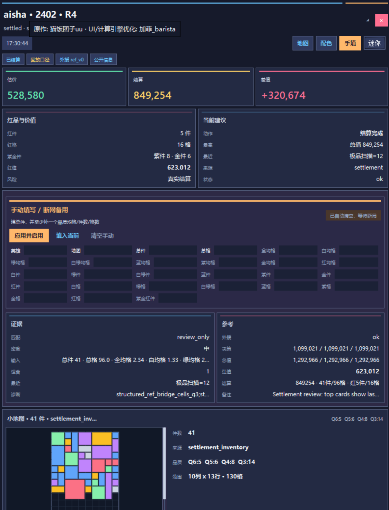
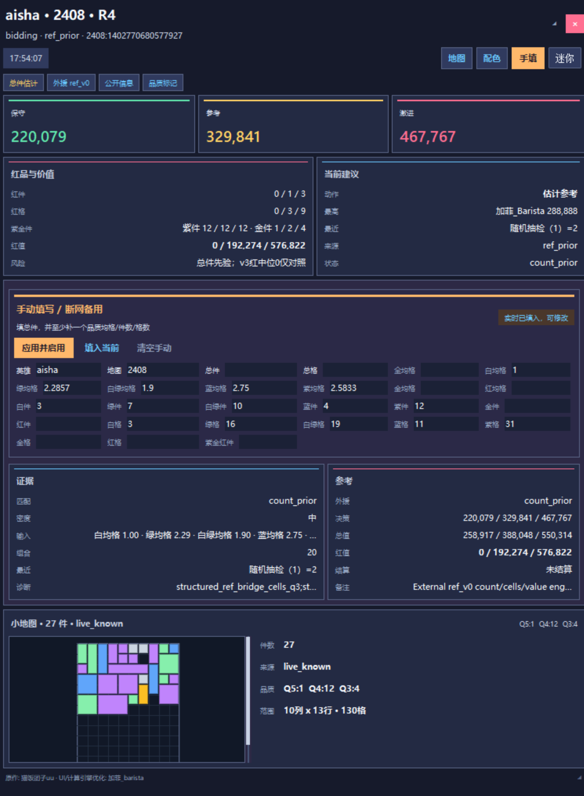
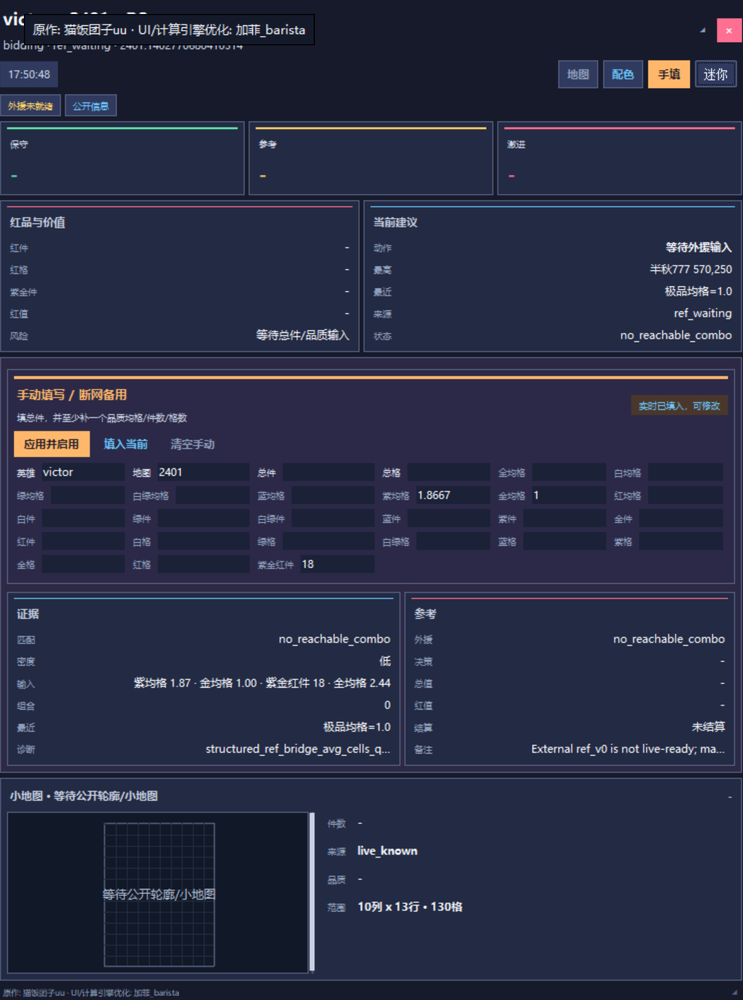

# Hero Ref 支线阶段收口

日期：2026-06-09

## 状态

Hero Ref 支线已到可实战试用阶段。当前目标是给 Ahmad / Victor / Aisha 提供一个轻量外援参考工具，而不是替换主线 v3 sampler，也不改正式出价 gate。

当前可用链路：

```text
WinDivert monitor / Fatbeans packet
  -> data/logs/live/latest_snapshot.json
  -> structured_ref_inputs / ui_contract
  -> external ref_v0 count/cell/value engine
  -> compact Tk overlay + manual fallback + minimap
```

推荐启动方式：

```powershell
cd C:\xiangmuyunxing\biancheng\2026\bidking-lab
.\scripts\start_live_windivert_overlay.ps1 -Restart -PortOnly -NoOverlay -PythonPath C:\Python313\python.exe
.\external_references\ahmad_live_reference_lab\start_ahmad_overlay.ps1 -Restart -PythonPath C:\Python313\python.exe
```

一站式 portable 包已能生成，但 2026-06-09 收口版仍依赖本机 `C:\Python313\python.exe`、`pydivert` 和 `psutil` 来启动 monitor。完全内置 Python runtime / 单 zip 推广包留到下一阶段，不在本次收口内继续扩张。

## 媒体记录

实战演示视频：

[Hero Ref live demo video](https://github.com/user-attachments/assets/b4ce74ee-69a5-422a-921b-c55deb82ae14)

如果 Markdown 渲染器支持 HTML video，可直接预览：

<video src="https://github.com/user-attachments/assets/b4ce74ee-69a5-422a-921b-c55deb82ae14" controls width="720"></video>

截图：

| 场景 | 记录 |
| --- | --- |
| Hero Ref 结算复核：估价、结算、差值、红品价值和 settlement minimap |  |
| Aisha 2408 R4 detail：`count_prior`、手填栏、live minimap、三档估价 |  |
| Victor 2401 sparse/manual waiting：无总件或关键约束不足时的 waiting/no_reachable 状态 |  |

## 已完成能力

- Ahmad / Victor / Aisha 均可进入 `ref_v0` 参考层。
- Ahmad `100204x`、Victor `100209`、普通道具 `100104-100120` 的 source -> transform -> output 映射已写入 focused tests。
- Victor `100209` 已按实战文本确定为 `q4+q5+q6` 件数和，UI 文案统一为 `紫金红件`。
- `field7` 已纳入数字结果解析，覆盖 Ahmad 总件和普通件数道具。
- `0` 均格是合法输入；缺结果但同局推进时才标记 `inferred_zero`，不静默当作真实观测。
- 手填 fallback 支持 live 输入叠加，不应中断 monitor；新 session / stale settlement / monitor restarted 会清空 manual overlay。
- Aisha 白/绿 split 已接入：white-only 只做 q1 下界，white+green 齐全且未被用户手填 q1 时才合并为白绿总栏。
- `均格 + 件数`、`均格 + 总格` 会校验整数格可达性；不接受无法组成整数格的组合。
- 小地图支持 `live_known`、`public_info marker`、`settlement_inventory`：公开品质 marker 画圆点，hard footprint / settlement 画方块。
- 旧 snapshot 待机：普通或结算旧快照超过约 60 秒不会继续显示旧局报价。
- 关闭 Hero Ref 默认会联动停止 monitor；`-KeepMonitorOnClose` 仅用于回放/调试。
- 已兼容快递/仓库、集装箱、别墅、沉船/活动沉船和 hidden 的基础地图族。快递/仓库/集装箱读取外援 StaticData 的 tier 与 nest price；hidden 当前若缺本地专属价格表，会显式显示 `fallback_default_price`。

## 关键问题与处理

| 问题 | 当前处理 |
| --- | --- |
| 开局 hero 显示 `?`，要等道具后才识别 | server summary / 手填预填会从 ref evidence 恢复 supported hero；仍需防范 VPN/UU partial capture |
| Victor `100209` 初始误解为紫+金 | 已修正为紫+金+红件数和，并保留旧 `q4q5` 仅历史兼容 |
| 金均格 `0` 或显示小数导致无解 | `0` 均格合法化；一位显示值按整数格可达性反推，不能把 `1.8` 直接当浮点硬乘 |
| 结算或跨局后手填残留 | 新 session / settled / stale / restarted 清理 manual overlay；用户 dirty 字段只在同 session 内保留 |
| public marker 被画成方块 | 显式 `render_mode=marker` 优先，公开品质软线索画圆点；硬 footprint 仍画方块 |
| 截图/回放 old snapshot 污染启动状态 | 旧快照进入待机，不继续展示旧价格 |
| 非别墅地图早期 sparse prior 套别墅总件 | 已按地图族设置默认中心：快递/仓库 24，集装箱 27，别墅 28，沉船/hidden 33 |

## 边界

- Hero Ref 是实战参考工具，不接主线 formal decision，不替换 v3 promotion gate。
- 不把 OCR 作为默认入口；OCR 只保留为潜在高级/人工补录方向。
- hidden 当前本地外援表没有专属 nest price 时只能 fallback 默认价格；这不是 hidden 专属校准。
- VPN/UU 可能导致 partial capture；新增样本入库前仍需 strict manifest 区分 valid / mixed / partial。
- portable 包当前含本机 raw tables，仅用于本地测试；公开发布前应使用 public-safe 方案或重新确认授权边界。
- 样本只有几百局，不能把支线调成按样本过拟合；核心价值是正确利用实时证据和保持可解释。

## 验证记录

最近已通过的支线检查包括：

```powershell
C:\Python313\python.exe -m py_compile external_references\ahmad_live_reference_lab\src\ahmad_ref_engine.py
C:\Python313\python.exe -m pytest --basetemp=.tmp\codex\pytest_hero_ref_maps tests\test_ahmad_ref_engine_public_info.py -q
```

结果：`28 passed`，覆盖地图族 tier/nest/fallback、公开信息、Aisha split、Victor `q4+q5+q6`、均格整数格可达性、手填语义。

较早的 UI / live bridge focused suite 结果：

- Hero Ref overlay/public-info focused suite：`96 passed`；
- 支线 broad suite：`206 passed, 25 skipped`；
- packaged UI exe smoke：通过；
- 最新五局实战样本 manifest：全部 `ready_only`、`valid`。

## 文件入口

- 支线 README：`external_references/ahmad_live_reference_lab/README.zh-CN.md`
- 支线交接：`external_references/ahmad_live_reference_lab/HANDOFF_2026-06-09.zh-CN.md`
- 支线执行记录：`external_references/ahmad_live_reference_lab/EXECUTION_NOTES_2026-06-09.zh-CN.md`
- 主线索引：`docs/hero_ref_branch_2026-06-09.zh-CN.md`
- portable 包模板：`apps/hero_ref/`
- 当前本地构建输出：`external_references/ahmad_live_reference_lab/dist/BidKingHeroRefPortable`

## 下一阶段

下一阶段应先做完全内置运行时的一站式 zip / exe 文件夹，而不是继续扩大推理范围：

1. 将 Python runtime 或必要依赖打入 portable 包，减少用户本机环境要求。
2. 明确 WinDivert 开源说明、火绒信任提示、raw table public-safe 策略。
3. 对推广包做敏感路径、日志、用户目录、raw table、临时文件审查。
4. 保持 Hero Ref 与主线 v3 解耦；主线 sampler promotion 继续由独立目标推进。
